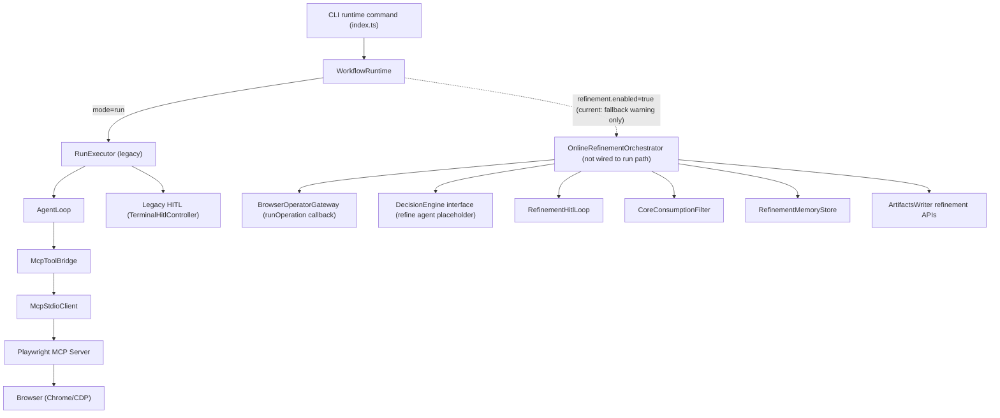
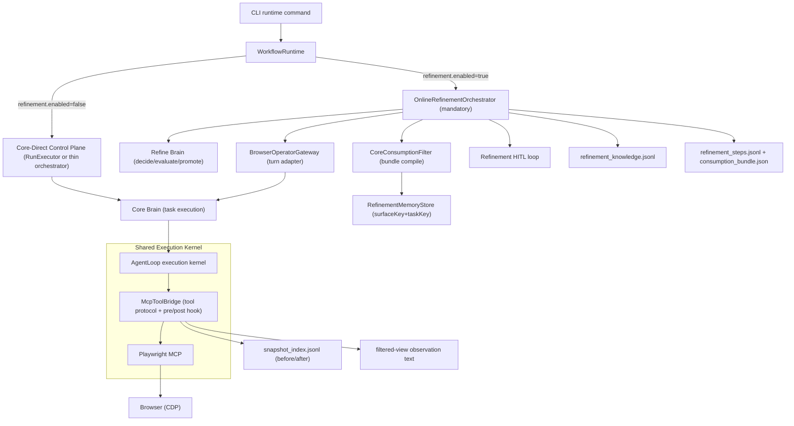

# Replay + Online Refinement Architecture Design (2026-03-12)

## 1. Architecture Context
当前基线已有两条主链：
- `sop agent`：`sop-compact` 产出 `compact_capability_output`（已完成）。
- `core run`：`WorkflowRuntime -> RunExecutor -> AgentLoop` 负责执行与当前 HITL。

现状问题：`run` 消费层仍主要把 guide/hints 拼入 task prompt，缺少执行期的在线学习闭环，导致页面快照和上下文持续膨胀。

本阶段目标：新增 `refine agent` 在线闭环，形成“执行证据采集 -> 相关性沉淀 -> 下轮压缩消费”能力，不回退到 heuristic 规则机。  
本版冻结架构语义：`Shared Execution Kernel + Two Brains + Mode-Gated Orchestrator`，避免后续实现把 `core` 与 `refine` 职责再次混写。

### 1.1 End-to-End Topology (As-Is)


### 1.2 Target Topology (To-Be, Frozen)


### 1.3 Ownership Clarification
- `Shared Execution Kernel`（`AgentLoop + McpToolBridge + MCP`）是唯一浏览器执行内核，`refinement/core-direct` 两种模式共享。
- `Refine Brain` 只负责优化/训练闭环：评估、HITL 决策、知识晋升；不直接调用浏览器工具。
- `Core Brain` 只负责任务执行与页面动作决策；通过 shared kernel 与浏览器交互。
- `Orchestrator` 在 `refinement mode` 是必选主控；在 `core-direct mode` 可选为薄控制平面（也可直接走 `RunExecutor`）。

### 1.4 Mode Matrix (Concise Freeze)
| Runtime Switch | Logical Mode | Orchestrator Role | Active Brain(s) | Browser Execution Path | HITL Owner | Knowledge Promotion |
| --- | --- | --- | --- | --- | --- | --- |
| `refinement.enabled=true` | `refinement` | Mandatory state machine | `Refine Brain` + `Core Brain` | `BrowserOperatorGateway -> Core Brain -> Shared Execution Kernel` | `refinement-hitl-loop` | Enabled (`promote/hold`) |
| `refinement.enabled=false` | `core-direct` | Optional thin control plane (or none) | `Core Brain` only | `Core Brain -> Shared Execution Kernel` | legacy HITL (if enabled) | Disabled |

## 2. Boundary and Ownership
### 2.1 Refine Brain + Orchestrator (Refinement Mode)
- 负责 replay/refinement session 生命周期。
- 负责回合推进、是否触发 HITL、是否提升为 knowledge。
- 不直接执行底层浏览器工具，不绑定 selector 细节。
- 在 `refinement mode` 中为强制入口，不允许绕过 orchestrator 直接进入工具层。

### 2.2 Browser Operator Gateway
- 位于编排层与执行层之间，负责“一回合输入 -> 一次 Core Brain 执行 -> 结构化结果输出”。
- 接收 `consumption_bundle + turn context`，调用 Core Brain 执行页面操作。
- 回传步骤级工具调用、前后 snapshot、动作结果；不做工具协议兼容转换。

### 2.2.1 Gateway Layering: `BrowserOperatorGateway` vs `McpToolBridge`
- `BrowserOperatorGateway`：编排层 gateway，管理 turn 级输入输出与结果归档语义（pageStep/toolCall/outcome）。
- `McpToolBridge`：工具协议层 gateway，负责 MCP tool schema/execute 适配与 pre/post hook 注入。
- 约束：`BrowserOperatorGateway` 不改写 MCP 原始 `details`；`McpToolBridge` 不承担回合决策与知识晋升。

### 2.3 HITL Loop (Refinement)
- 负责在关键无进展步骤触发人工介入。
- 负责记录人工修正和 resume 指令。
- 不负责 schema 归一化，不直接写长期知识。

### 2.4 Refinement Memory / Knowledge Store
- append-only 保存原始 refinement episodes。
- 维护 promoted knowledge 索引与 provenance。
- 与 `SopAssetStore` 分离，避免静态资产与在线学习记录混合。

### 2.5 Core Consumption Filter
- 读取 capability + promoted knowledge，生成低 token `consumption_bundle`。
- 仅做裁剪/去重/cap/surface gating，不做语义规则推断替代 agent。

## 3. Options and Tradeoffs
### Option A: 在 `RunExecutor` 内直接扩展 refinement
- 优点：改动少，上线快。
- 缺点：职责继续耦合，后续难定位“执行失败 vs 知识污染”。

### Option B: Sidecar `OnlineRefinementOrchestrator`（推荐）
- 优点：贴合当前代码结构，增量迁移清晰，能保持 agent-first。
- 缺点：需要新增 tool-call hook 与 step snapshot 采集。

### Option C: 三代理黑板架构（planner/refiner/operator）
- 优点：长期扩展性最好。
- 缺点：当前阶段过重，验证周期长，失败归因复杂。

结论：采用 Option B，先拿到最小可验证闭环。

## 4. Recommended Shape
### 4.1 Runtime Flow
`compact_capability_output -> core consumption filter -> BrowserOperatorGateway -> Core Brain -> Shared Execution Kernel -> step capture -> Refine Brain evaluate/promote -> HITL(conditional) -> next-round bundle`

### 4.1.1 Loop State Machine (v0)
`INIT -> OPERATE -> EVALUATE -> (HITL | PROMOTE_OR_HOLD) -> NEXT_PAGE_STEP -> ... -> FINALIZE`

状态说明：
- `OPERATE`：Core Brain（经 Shared Execution Kernel）执行当前 page-step 内动作。
- `EVALUATE`：refine agent 判断 `outcome/relevance`。
- `HITL`：当 `outcome=no_progress` 立即进入。
- `PROMOTE_OR_HOLD`：refiner + critic + refiner-final 产出 `promoteDecision/confidence`。
- `NEXT_PAGE_STEP`：继续下一 page-step 或结束。

终止条件（任一满足即结束）：
- `goal_achieved`：业务成功信号满足（当前 benchmark 为“草稿保存成功”）。
- `user_stopped`：用户主动终止。
- `max_round_reached`：达到配置上限。
- `hard_failure`：关键依赖不可恢复（如浏览器会话失效且无法恢复）。

### 4.1.2 Migration Policy for Legacy Single-Round Paths
- 不忽视现有单轮/单次 workflow 结构（`RunExecutor + AgentLoop`）；将其作为 legacy 执行通路保留。
- 新架构采用“sidecar 增量迁移”：
  - `refinement.enabled=false`：继续旧通路（兼容保底）。
  - `refinement.enabled=true`：进入 `OnlineRefinementOrchestrator`，通过 `BrowserOperatorGateway` 驱动 Core Brain，再落到 shared kernel。
- 迁移原则：先 adapter 化，不做大规模重构；待 Slice-1 稳定后再评估回收 legacy 分支。

### 4.1.3 Slice-1 Blocking Decisions (Resolved)
- B1 Snapshot 采集机制：不新增 MCP 工具；在 `McpToolBridge` 执行前后注入 snapshot hook。
  - 前置：`browser_snapshot` 获取 `beforeSnapshot`。
  - 执行：目标 tool call（click/type/select/run_code 等）。
  - 后置：`browser_snapshot` 获取 `afterSnapshot`。
  - 若 snapshot tool 不可用，降级使用 `AgentLoop.captureObservationSummary()`，并标记 `snapshot_mode=summary_fallback`。
  - 写入归属：`snapshot_index.jsonl` 由 execution adapter（当前 `OnlineRefinementRunExecutor`）统一落盘；`McpToolBridge` 只负责提供 hook 观测能力。
- B2 refine agent I/O schema：采用三次独立 LLM call（`refiner -> critic -> refiner-final`），每次均是结构化 JSON 输出。
- B3 跨 run 继承：新增 `RefinementKnowledgeStore` 的全局索引，按 `surfaceKey + taskKey` 检索，支持第二轮加载首轮知识。

### 4.1.4 Core Consumption Strategy Freeze (Resolved)
- 主路径（v0 默认）：`MCP hook filtered-view`。
  - full snapshot 仍完整落盘（用于离线审计和回放）。
  - Core Brain 在在线执行时默认只消费过滤后的 view（低 token）。
- 备选路径（v0 仅 debug）：`full snapshot file read`。
  - 不作为默认执行路径，不要求 Core Brain 具备通用 bash 浏览文件能力。
  - 仅用于排障（如 filtered-view 明显失真）时人工启用。
- 原则：先稳定在线执行主路径，再考虑“coding-agent 读文件”扩展形态，避免 agent 在文件系统中打转。

### 4.2 Core Contracts
#### `RefinementStepRecord`
- `runId`, `sessionId`, `stepIndex`
- `recordUnit`（v0 固定 `tool_call`）
- `pageStepId`（同页面连续操作的聚合键）
- `toolCallId`
- `operationIndexWithinPageStep`
- `pageBoundaryReason`（可选：`navigation|tab_switch|url_change|manual_reset`）
- `pageId`（step 的 page 归属）
- `beforeSnapshot`, `afterSnapshot`
- `assistantIntent`
- `toolName`, `toolArgs`, `resultExcerpt`
- `elementHints` (`ref/selector/text/role`)
- `outcome` (`progress|no_progress|page_changed|info_only|blocked`)
- `relevance` (`task_relevant|task_irrelevant|unknown`)
- `human_intervention_note[]`（仅记录纠偏，不做历史标签重写）
- `snapshot_mode` (`full|summary_fallback`)

最小 JSON 示例：
```json
{
  "runId": "20260312_210000_001",
  "sessionId": "refine_20260312_001",
  "recordUnit": "tool_call",
  "pageStepId": "page_creator_edit#1",
  "toolCallId": "tc_001",
  "operationIndexWithinPageStep": 3,
  "pageBoundaryReason": "url_change",
  "pageId": "page_creator_edit",
  "stepIndex": 3,
  "beforeSnapshot": {
    "path": "artifacts/e2e/20260312_210000_001/snapshots/page_creator_edit_step3_before.md",
    "summary": "编辑页包含标题输入框与正文输入框",
    "snapshot_hash": "sha256:before_hash"
  },
  "afterSnapshot": {
    "path": "artifacts/e2e/20260312_210000_001/snapshots/page_creator_edit_step3_after.md",
    "summary": "正文区域出现已输入文本",
    "snapshot_hash": "sha256:after_hash"
  },
  "assistantIntent": "在正文输入框填写长文内容",
  "toolName": "browser_type",
  "toolArgs": { "ref": "e125", "text": "..." },
  "resultExcerpt": "typed successfully",
  "elementHints": { "ref": "e125", "text": "正文", "role": "textbox" },
  "outcome": "progress",
  "relevance": "task_relevant",
  "human_intervention_note": []
}
```

#### `PromotedKnowledgeRecord`
- `schemaVersion`
- `knowledgeId`
- `knowledgeType` (`element_affordance|branch_guard|completion_signal|recovery_rule|noise_pattern`)
- `surfaceKey`
- `instruction`
- `sourceStepIds`
- `confidence` (`high|medium|low`, agent 后验判断)
- `provenance`
- `taskKey`
- `status` (`active|superseded|held`)
- `createdAt`
- `updatedAt`

最小 JSON 示例：
```json
{
  "schemaVersion": "refinement_knowledge.v0",
  "knowledgeId": "kg_6a2d...",
  "knowledgeType": "completion_signal",
  "surfaceKey": "xiaohongshu.creator",
  "taskKey": "task_93c1...",
  "instruction": "检测到“草稿已保存”提示可判定任务完成",
  "sourceStepIds": ["page_creator_edit#step8"],
  "confidence": "high",
  "status": "active",
  "createdAt": "2026-03-12T13:00:00.000Z",
  "updatedAt": "2026-03-12T13:10:00.000Z",
  "provenance": {
    "runId": "20260312_210000_001",
    "pageId": "page_creator_edit",
    "stepIndex": 8,
    "snapshot_hash": "sha256:after_hash_step8"
  }
}
```

#### `CoreConsumptionBundle`
- `task`
- `capabilitySummary`
- `surfaceScopedKnowledge[]`
- `activeGuards[]`
- `negativeHints[]`
- `tokenBudget`
- `tokenEstimate`
- `estimatorVersion`
- `snapshotRefs[]`（可选，指向离线 full snapshot 索引）

最小 JSON 示例：
```json
{
  "task": "小红书新建长文草稿保存",
  "capabilitySummary": "进入创作页，填写正文，触发草稿保存并校验成功信号",
  "surfaceScopedKnowledge": [
    "正文输入框通常位于编辑页主体，顶部导航和底部推荐区大多无关"
  ],
  "activeGuards": [
    "若未出现保存成功信号，不得宣称完成"
  ],
  "negativeHints": [
    "忽略顶部全局导航和底部推荐卡片文本"
  ],
  "tokenBudget": 1000,
  "tokenEstimate": 742,
  "estimatorVersion": "char_div_4.v0",
  "snapshotRefs": ["sp_001", "sp_002"]
}
```

### 4.2.1 Field Dictionary (Write Semantics)
| Field | Meaning | Writer | Notes |
| --- | --- | --- | --- |
| `beforeSnapshot` | 动作前页面状态索引 | execution adapter（gateway/executor） | 来源优先 hook；无 hook 时回退 `captureObservationSummary` |
| `afterSnapshot` | 动作后页面状态索引 | execution adapter（gateway/executor） | 用于比较动作影响，写入 `snapshot_index.jsonl` |
| `assistantIntent` | 当前动作意图 | refine agent | 从 reasoning 摘要提炼，不做规则猜测 |
| `outcome` | 本步推进结果 | refine agent | `no_progress` 会直接触发 HITL |
| `relevance` | 本步任务相关性 | refine agent | v0 无人工离线重标注机制 |
| `promoteDecision` | 是否晋升知识 | refine agent final pass | `promote` 或 `hold` |
| `confidence` | 晋升置信等级 | refine agent final pass | 枚举级，不是规则分值 |
| `provenance` | 证据回链锚点 | orchestrator | `runId+pageId+stepIndex+snapshot_hash` |
| `knowledgeId` | 知识主键 | knowledge store | `sha256(surfaceKey+taskKey+knowledgeType+instruction_normalized)` |
| `tokenBudget` | bundle 注入上限 | consumption filter | v0 固定 1000 |
| `estimatorVersion` | token 估算器版本 | consumption filter | v0=`char_div_4.v0` |

### 4.2.4 MCP Hook Trigger Contract (Blocking Closure)
- pre/post snapshot hook 仅对“浏览器 mutation 工具”生效。
- v0 mutation 工具白名单：
  - `browser_click`
  - `browser_type`
  - `browser_fill_form`
  - `browser_select_option`
  - `browser_press_key`
  - `browser_drag`
  - `browser_file_upload`
  - `browser_handle_dialog`
  - `browser_navigate`
  - `browser_navigate_back`
  - `browser_tabs`（`action=create|close|select`）
  - `browser_run_code`
- 非 mutation 工具（如 `browser_snapshot`、`browser_take_screenshot`、`browser_console_messages`、`browser_network_requests`）不触发 pre/post snapshot hook。
- `toolClass`（v0）：
  - `mutation`：触发 pre/post snapshot
  - `observation`：不触发
  - `meta`：不触发
- 防递归规则：
  - hook 内部调用的 `browser_snapshot` 必须标记 `hookOrigin=hook_internal`
  - `hookOrigin=hook_internal` 的调用不得再次触发 hook
- capture 写入状态枚举：
  - `captureStatus`：`captured|fallback|skipped|failed`
  - `captureError`：仅 `failed` 时写入
  - `snapshotLatencyMs`：采集耗时（毫秒）

### 4.2.5 MCP Tool Return Compatibility Contract (Blocking Closure)
- 不改变 tool call 的外层返回结构：
  - `content: [{ type: "text", text: string }]`
  - `details: ToolCallResult`（保留原始 MCP 返回）
- refinement 仅允许改写 `content[0].text` 的“观察视图文本”（filtered-view），不得改写：
  - `toolName`
  - `toolArgs`
  - `isError`
  - MCP 原始 `details` 对象
- 约束目标：让 Core Brain 感知更精简的页面上下文，同时保证上层工具协议兼容与审计可回放。
- normalized result（v0）：
  - `resultKind`：`text|json|binary_ref|empty`
  - `normalizedText`：用于 `resultExcerpt` 与 filtered-view 的统一文本源
  - `normalizedIsError`：统一错误语义（优先 MCP `isError`，其次解析失败）
  - `parserVersion`：归一化解析器版本
- `resultExcerpt` 必须来自 `normalizedText`，禁止各模块自行二次截断。

### 4.2.6 Snapshot Index Contract (Blocking Closure)
- full snapshot 统一落盘到 `artifacts/e2e/<run_id>/snapshots/`。
- 每次 pre/post 采集追加一条索引记录到 `snapshot_index.jsonl`：
  - `snapshotId`
  - `runId`
  - `pageId`
  - `stepIndex`
  - `phase` (`before|after`)
  - `path`
  - `snapshotHash`
  - `charCount`
  - `tokenEstimate`
  - `capturedAt`
- `RefinementStepRecord.beforeSnapshot/afterSnapshot` 只存索引引用和 summary，不内嵌 full snapshot 原文。

### 4.2.7 Filtered View Payload Contract (Blocking Closure)
- `filtered-view` 文本使用单一可解析结构（JSON string）：
```json
{
  "schemaVersion": "tool_observation_view.v0",
  "toolName": "browser_click",
  "toolResultSummary": "clicked successfully",
  "view": {
    "pageId": "page_creator_edit",
    "summary": "编辑页主体可见标题与正文输入区域",
    "actionableElements": ["正文输入框(ref=e125)", "保存草稿按钮(ref=e301)"],
    "ignoredRegions": ["顶部全局导航", "底部推荐区"],
    "evidenceRefs": ["snapshot:before:sp_001", "snapshot:after:sp_002"]
  }
}
```
- 裁剪规则（v0）：
  - `toolResultSummary <= 300 chars`
  - `summary <= 240 chars`
  - `actionableElements <= 8`
  - `ignoredRegions <= 6`
- 生成失败时回退：`content[0].text = 原始 tool result text`，并记录 `filtered_view_fallback=true`。

### 4.2.8 McpToolBridge Hook Interface Contract (Blocking Closure)
- 新增 observer 接口（v0）：
  - `beforeToolCall(ctx) -> Promise<BeforeCapture | null>`
  - `afterToolCall(ctx, rawResult, beforeCapture) -> Promise<AfterCapture | null>`
- `ctx` 最小字段：
  - `runId`
  - `sessionId`
  - `toolCallId`
  - `toolName`
  - `toolArgs`
  - `pageId`
  - `stepIndex`
- Hook 不得阻塞主工具调用：
  - hook 出错仅记录日志并降级，不得中断 tool call。

### 4.2.3 Refine Agent LLM I/O Schema (Blocking Closure)
`EvaluateCall`（refiner）输出：
```json
{
  "schemaVersion": "refine_evaluate.v0",
  "assistantIntent": "string",
  "outcome": "progress|no_progress|page_changed|info_only|blocked",
  "relevance": "task_relevant|task_irrelevant|unknown",
  "why": "string",
  "hitlNeeded": true,
  "hitlQuestion": "string|null",
  "candidateKnowledge": [
    {
      "knowledgeType": "element_affordance|branch_guard|completion_signal|recovery_rule|noise_pattern",
      "instruction": "string",
      "surfaceKey": "string",
      "taskKey": "string"
    }
  ]
}
```

`CriticCall` 输出：
```json
{
  "schemaVersion": "refine_critic.v0",
  "challenges": [
    {
      "targetInstruction": "string",
      "risk": "string",
      "counterExample": "string"
    }
  ]
}
```

`FinalizeCall`（refiner-final）输出：
```json
{
  "schemaVersion": "refine_finalize.v0",
  "promoteDecision": "promote|hold",
  "confidence": "high|medium|low",
  "rationale": "string",
  "finalKnowledge": [
    {
      "knowledgeType": "element_affordance|branch_guard|completion_signal|recovery_rule|noise_pattern",
      "surfaceKey": "string",
      "taskKey": "string",
      "instruction": "string"
    }
  ]
}
```

### 4.2.2 Confidence and Promotion (Non-Rule-Based)
- `confidence` 由 refine agent 作为后验判断输出，语义是“这条知识在同平台相似任务下仍能提升推进概率”。
- 采用 `refiner -> critic -> refiner-final` 三段式评估：
  - refiner 先给 `promoteDecision + confidence + rationale`。
  - critic 仅做反驳与失效场景挑战。
  - refiner-final 给最终 decision。
- 不使用基于 if/else 的规则打分决定语义正确性。
- 仅保留一个确定性 gate：`provenance` 必须完整，否则不得入库。

### 4.3 File-Level Shape (Slice-1)
新增：
- `apps/agent-runtime/src/domain/refinement-session.ts`
- `apps/agent-runtime/src/domain/refinement-knowledge.ts`
- `apps/agent-runtime/src/runtime/replay-refinement/online-refinement-orchestrator.ts`
- `apps/agent-runtime/src/runtime/replay-refinement/browser-operator-gateway.ts`
- `apps/agent-runtime/src/runtime/replay-refinement/refinement-memory-store.ts`
- `apps/agent-runtime/src/runtime/replay-refinement/core-consumption-filter.ts`
- `apps/agent-runtime/src/runtime/replay-refinement/refinement-hitl-loop.ts`

修改：
- `apps/agent-runtime/src/core/mcp-tool-bridge.ts`（tool call observer hook）
- `apps/agent-runtime/src/core/agent-loop.ts`（暴露 gateway 所需的 step/snapshot 接口）
- `apps/agent-runtime/src/runtime/artifacts-writer.ts`（新增 refinement artifacts 落盘）
- `apps/agent-runtime/src/runtime/runtime-config.ts`（新增 refinement 开关和限额）
- `apps/agent-runtime/src/runtime/workflow-runtime.ts`（按开关接线 orchestrator）

### 4.3.1 Knowledge Store Persistence and Lookup (Blocking Closure)
- 落盘目录：`~/.sasiki/refinement_knowledge/`
- 索引文件：`~/.sasiki/refinement_knowledge/index.json`
- 记录文件：`~/.sasiki/refinement_knowledge/records/<knowledge_id>.json`
- 索引键：
  - 一级：`surfaceKey`
  - 二级：`taskKey`
  - 值：`knowledgeIds[]`（按更新时间倒序）
- 第二轮加载路径：
  1) 使用当前任务生成 `surfaceKey + taskKey`
  2) 查询 index
  3) 读取 top-N knowledge（v0: `topN=8`）
  4) 进入 `CoreConsumptionBundle.surfaceScopedKnowledge[]`
- 排序规则（v0）：
  - 先 `status=active`
  - 再按 `confidence(high>medium>low)`
  - 最后按 `updatedAt desc`

### 4.3.2 Key Canonicalization Contract (Blocking Closure)
- `surfaceKey` 归一规则（v0）：
  - `<platform>.<surface>`，例如 `xiaohongshu.creator`
  - platform 来自站点白名单映射；surface 来自 URL path 主段（去 query/hash）
- `taskKey` 归一规则（v0）：
  - 对任务短描述做 lower-case + 空白归一 + 标点去噪后的 hash
  - 若用户显式指定 task alias，优先使用 alias
- 若 key 归一失败：
  - 不阻塞当前 run
  - 该轮知识仅写 raw episode，不进入跨 run promoted 索引

### 4.3.3 Token Estimate Contract (Blocking Closure)
- `tokenEstimate` 统一采用同一估算器（v0 为字符近似估算）：
  - `estimate = ceil(chars / 4)`（仅用于相对比较，不做计费精算）
- AC4 的 round2/round1 比较必须使用同一估算器版本。
- 若估算器版本变化，必须在 bundle 中写入 `estimatorVersion`，并禁止跨版本直接比较 AC4。
- trim 顺序（v0）：
  - `negativeHints` -> 低优先级 `surfaceScopedKnowledge` -> `capabilitySummary` 冗长尾部
- 不可裁剪字段：
  - `activeGuards`
  - completion signal 相关知识项

### 4.3.4 Knowledge Identity and Dedup Contract (Blocking Closure)
- `PromotedKnowledgeRecord` 增加：
  - `knowledgeId`（稳定主键）
  - `createdAt`
  - `updatedAt`
  - `status`
- `knowledgeId` 生成（v0）：
  - `sha256(surfaceKey + taskKey + knowledgeType + instruction_normalized)`
- 入库策略：
  - 同 `knowledgeId` 命中时执行 upsert（更新 `updatedAt` 与 provenance merge）
  - 不生成重复记录文件
  - 如新证据反驳旧知识：原记录标记 `status=superseded`，新记录 `status=active`

### 4.4 Compatibility Strategy
- 默认 `refinement.enabled=false`。
- 关闭时完全走旧 run 路径，避免行为漂移。
- 首期只支持 `--sop-run-id` pinned 输入，先隔离检索变量。
- bundle 注入先走 MCP client 预处理，不改 system prompt 与工具权限。
- refinement 模式开启时，旧 `RunExecutor` 内建 HITL 不再触发；由 `refinement-hitl-loop` 独占 pause/resume。

### 4.4.1 HITL Pause/Resume Integration (Gap Closure)
- v0 交互方式：CLI stdin（沿用终端交互能力，不做文件轮询）。
- 协议：
  - `EVALUATE` 输出 `hitlNeeded=true` -> orchestrator 暂停 Core Brain 当前 turn。
  - `refinement-hitl-loop` 获取用户输入并写入 `human_intervention_note`。
  - orchestrator 以 `resumeInstruction` 恢复下一步。
- 与旧机制共存规则：
  - `refinement.enabled=true`：new loop priority。
  - `refinement.enabled=false`：legacy loop priority。

### 4.4.2 First-Round Bundle Compile Path (Gap Closure)
- 第一轮无 promoted knowledge 时，`CoreConsumptionBundle` 由 `compact_capability_output` 编译：
  - `capabilitySummary` <- `taskUnderstanding + workflowSkeleton` 摘要
  - `surfaceScopedKnowledge[]` <- `actionPolicy.required/conditional` 的可执行要点
  - `activeGuards[]` <- `stopPolicy + reuseBoundary.notApplicableWhen`
  - `negativeHints[]` <- `actionPolicy.nonCoreActions + workflowSkeleton.noiseNotes`（若存在）
- 截断策略仅用于长度控制，不用于语义判定：
  - 单字段按字符上限截断
  - 全量按 `tokenBudget` 裁剪

### 4.4.3 Consumption Mode Contract (Blocking Closure)
- `consumption.mode`（v0）：
  - `filtered_view`（默认）：在线注入 filtered snapshot 视图。
  - `full_snapshot_debug`：仅 debug 模式启用，允许读取 full snapshot 引用信息。
- `filtered_view` 模式下，Core Brain 不直接读取 snapshot 文件系统；full snapshot 仅作为离线证据与回放输入。
- 两种模式都必须写同构工件：
  - `consumption_bundle.json`
  - `refinement_steps.jsonl`
  - `snapshot_index.jsonl`

### 4.4.4 Injection Timing Contract (Blocking Closure)
- `filtered-view` 注入时机固定：
  - 在 mutation tool `tool_execution_end` 后生成，并作为该次 tool 返回 `content[0].text` 提供给 Core Brain。
- 非 mutation tool 返回保持原样，不附加 filtered-view。
- 回放一致性要求：
  - 同一 `runId + stepIndex + toolCallId` 必须能回放到同一份 `tool_observation_view.v0`（在相同 estimatorVersion 下）。

### 4.4.5 HITL Payload Contract (Blocking Closure)
- refinement HITL 输入输出字段沿用现有终端交互语义并最小扩展：
  - request: `schemaVersion, pauseId, runId, sessionId, attempt, issueType, operationIntent, failureReason, beforeState, context, pageId, stepIndex, toolCallId, assistantIntent, hitlQuestion`
  - response: `schemaVersion, pauseId, humanAction, resumeMode, resumeInstruction, nextTimeRule, resolvedAt`
- `resumeMode`（v0）：
  - `retry_step|continue_current_state|skip_step|abort_run`
- `human_intervention_note` 写入规则：
  - 至少包含 `humanAction` 与 `resumeInstruction` 的摘要
  - `nextTimeRule` 进入 `refinement_knowledge.jsonl`，不直接覆盖历史步骤标签

## 5. Migration and Risk
- 风险 1：知识污染。控制策略：raw episode 全量保留，但只有 promoted knowledge 进入消费层。
- 风险 2：事件错位。控制策略：以“浏览器 mutation 工具调用”作为 step 主键，不从最终 steps 倒推。
- 风险 3：双 HITL 循环冲突。控制策略：refinement 开启时由 `OnlineRefinementOrchestrator + refinement-hitl-loop` 接管 HITL，旧 loop 仅作底线 fallback。
- 风险 4：DOM 过拟合。控制策略：优先沉淀 affordance/branch/success signal，弱化 selector。
- 风险 5：token 反增。控制策略：bundle 强制 token budget + snapshot chars cap。

## 6. Verification Hooks
- Hook 1（Contract）：每个浏览器 mutation 操作都能产出 `RefinementStepRecord`，并附带 `pageId` 与 before/after snapshot 索引。
- Hook 2（Artifacts）：每次 refinement run 落盘：
  - `refinement_steps.jsonl`
  - `consumption_bundle.json`
  - `refinement_knowledge.jsonl`（总是创建；允许为空）
  - `snapshot_index.jsonl`
- Hook 3（Compatibility）：`refinement.enabled=false` 回归输出与当前 run 一致。
- Hook 4（Knowledge Provenance）：每条 promoted knowledge 可回链 `runId + stepIndex + snapshot hash`。
- Hook 5（Benchmark）：小红书长文草稿任务两轮验证：
  - 轮次 1：允许 HITL，拿到首批 promoted knowledge。
  - 轮次 2：`consumption_bundle.tokenEstimate <= round1 * 0.8`，且任务仍成功。
- Hook 6（Review）：人工 spot check `task_relevant/task_irrelevant` 标注准确性，防止噪声长期化。
- Hook 7（Confidence）：每条 promoted knowledge 必须包含 `refiner rationale + critic challenge + final decision` 的审计字段。
- Hook 8（Cross-run）：第二轮必须读取到第一轮的 `surfaceKey + taskKey` 知识索引，日志中出现 `knowledge_loaded_count>0`。

## 7. Log Event Contract (Blocking Closure)
- 统一事件：`refinement_knowledge_loaded.v0`
- 最小 payload：
  - `runId`
  - `sessionId`
  - `surfaceKey`
  - `taskKey`
  - `knowledge_loaded_count`
  - `knowledge_selected_ids[]`
  - `bundle_source`（`capability_only|capability_plus_knowledge`）
- `knowledge_loaded_count` 验收口径：
  - round2 必须 `>0`
  - 与 `consumption_bundle.json` 的 `surfaceScopedKnowledge` 长度一致或可解释

## 7.1 Decision Audit Contract (Blocking Closure)
- v0 必须保留两类能力：
  - 运行期 API：`getDecisionAudit(toolCallId)`、`listDecisionAudits()`
  - 运行期日志：`refinement_decision_evaluate_*`、`refinement_decision_promote_*`
- `DecisionAudit` 最小字段：
  - `toolCallId`
  - `evaluate.result`（含 `assistantIntent/outcome/relevance/hitlNeeded`）
  - `evaluate.rationale`
  - `criticChallenge[]`
  - `promote.result`（含 `promoteDecision/confidence/rationale`）
  - `promote.finalKnowledge[]`
  - `updatedAt`
- 约束：
  - `promoteDecision=promote` 时，写入 knowledge 的记录必须可回链到对应 `DecisionAudit.toolCallId`
  - `promoteDecision=hold` 时，也必须保留 audit（不可静默丢失）
