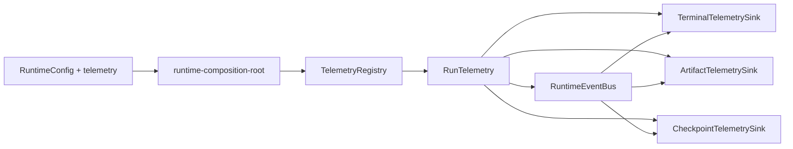

# Runtime Telemetry Event Stream Design

## Problem

The current runtime observability and persistence surfaces are hard to reason about and too tightly coupled to workflow execution.

Today:

- terminal output is mostly driven by `RuntimeLogger` line writes instead of a stable runtime event model
- refine execution does not stream assistant behavior to the terminal in real time, even though `pi-agent` exposes runtime events
- artifact persistence is split across multiple ad-hoc construction sites
- `observe`, `refine`, and `compact` each decide locally when to instantiate writers and stores
- refine artifacts contain repeated projections of the same run facts
- there is no stable checkpoint artifact for reproducing a key assistant turn during debugging

This makes future changes expensive:

- observability changes require touching executors instead of swapping sinks at composition time
- replay/debug work has no canonical machine-consumable run truth
- artifact contracts are harder to trim because the current writer owns both canonical persistence and duplicated projections

This spec defines a light-weight telemetry model that separates:

- runtime event production
- terminal monitoring
- artifact persistence
- reusable business outputs such as attention knowledge and compact capability output

without turning the runtime into a full event-sourced system.

Non-normative reference:

- `pi-mono` shows a useful split between a fine-grained low-level agent event stream, a very thin app-level event bus, and append-only session persistence:
  - [`packages/agent/src/agent-loop.ts`](https://github.com/badlogic/pi-mono/blob/main/packages/agent/src/agent-loop.ts)
  - [`packages/agent/src/types.ts`](https://github.com/badlogic/pi-mono/blob/main/packages/agent/src/types.ts)
  - [`packages/coding-agent/src/core/event-bus.ts`](https://github.com/badlogic/pi-mono/blob/main/packages/coding-agent/src/core/event-bus.ts)
  - [`packages/coding-agent/src/core/agent-session.ts`](https://github.com/badlogic/pi-mono/blob/main/packages/coding-agent/src/core/agent-session.ts)
  - [`packages/coding-agent/src/core/session-manager.ts`](https://github.com/badlogic/pi-mono/blob/main/packages/coding-agent/src/core/session-manager.ts)

## Success

- assistant `thinking` / `text` is visible in the terminal during refine execution without waiting for final artifact flush
- runtime observability is configured through a dedicated `telemetry` config surface
- telemetry dependencies are created in the composition root and injected into workflows up front
- runtime event truth is captured in one canonical `event_stream.jsonl`
- refine artifacts are reduced to a smaller set of canonical and machine-consumable outputs
- key assistant turns can emit reproducible checkpoints, with a config switch reserved for all-turn capture
- `RuntimeConfig` becomes the single canonical config contract, with `RuntimeBootstrapProvider` only implementing loading/parsing

## Out Of Scope

- no new CLI command surface such as `replay`
- no full replay runner implementation in this pass
- no redesign of refine prompt semantics, tool contracts, or attention knowledge ranking
- no attempt to unify observe, refine, and compact into one workflow executor
- no full event-sourcing rewrite where every runtime state mutation must be modeled as a projection

## Current Diagnosis

### 1. Logger And Artifact Ownership Are Mixed Into Runtime Flow

`RuntimeLogger` is created once in the composition root, but artifact creation is still scattered:

- observe constructs its own `ArtifactsWriter` and `SopAssetStore`
- refine constructs persistence context in one place and the run writer in another
- compact uses `ArtifactsWriter` but still appends `runtime.log` directly

This makes composition incomplete: shared observability policy is not actually centralized.

### 2. Event Facts Are Available But Not Elevated To A Stable Contract

`AgentLoop` already sees the assistant and tool lifecycle events that matter for monitoring and debugging, but those facts are collected into run-local arrays and only become useful after execution completes.

That is enough for end-of-run summaries, but not enough for:

- real-time operator visibility
- stable machine-consumable run truth
- key-turn checkpoint emission

The strongest external pattern match is that `pi-mono` does not invent a heavy runtime bus below the agent loop. It exposes low-level `AgentEvent` facts and lets upper layers serialize, persist, and react to them in order. That is the correct direction here as well.

### 3. Artifact Output Has Redundant Run Projections

The current refine output writes overlapping views of the same run:

- `steps.json`
- `assistant_turns.json`
- `refine_turn_logs.jsonl`
- `refine_browser_observations.jsonl`
- `refine_action_executions.jsonl`
- `refine_knowledge_events.jsonl`
- `run_summary.json`

Some of these are useful as read models, but they should not all remain canonical truth.

### 4. Config Contract Ownership Is Duplicated

`application/config/runtime-config.ts` and `infrastructure/config/runtime-bootstrap-provider.ts` both define runtime config shapes.

The intended layering is valid:

- application owns the config contract
- infrastructure owns config loading

but the current duplicate type definitions blur that split and make drift likely.

## Critical Paths

1. Freeze a dedicated `telemetry` config contract and route it through the existing runtime config loader.
2. Introduce a composition-time telemetry registry that can create run-scoped telemetry dependencies.
3. Make `AgentLoop` and workflow code emit structured runtime events instead of depending on final flush behavior.
4. Reduce refine artifacts to one canonical event stream plus a small set of machine-consumable outputs.
5. Add key-turn checkpoint emission now, while reserving an all-turn capture mode for later debugging.

## Frozen Contracts

- supported CLI commands remain:
  - `observe`
  - `refine`
  - `sop-compact`
- there is still no replay CLI command in this phase
- `telemetry` is a cross-workflow runtime concern, not a refine-only concern
- `RuntimeConfig` is the canonical config contract home
- `RuntimeBootstrapProvider` remains the env/file loading adapter only
- attention knowledge remains a long-lived business store rather than a per-run projection
- SOP compact capability output remains the canonical compact result artifact
- all-turn checkpoint capture must be configurable, but it does not have to be the default

## Telemetry Config Contract

Add a dedicated `telemetry` section to the runtime config contract.

```ts
telemetry?: {
  terminal?: {
    enabled?: boolean;
    mode?: "progress" | "agent";
  };
  artifacts?: {
    eventStream?: boolean;
    checkpointMode?: "off" | "key_turns" | "all_turns";
  };
}
```

Resolved runtime shape:

```ts
interface RuntimeTelemetryConfig {
  terminalEnabled: boolean;
  terminalMode: "progress" | "agent";
  artifactEventStreamEnabled: boolean;
  artifactCheckpointMode: "off" | "key_turns" | "all_turns";
}
```

Rules:

- `terminal.mode = "progress"` prints workflow and tool progress only
- `terminal.mode = "agent"` includes assistant `thinking` / `text` in real time
- `artifactEventStreamEnabled` defaults on for refine
- `artifactCheckpointMode = "key_turns"` is the default production mode
- `artifactCheckpointMode = "all_turns"` is reserved for deep debug and must stay opt-in

Environment variable support may be added, but only through the same `RuntimeBootstrapProvider` path that already resolves the rest of `RuntimeConfig`.

## Config Ownership

After this refactor:

- `application/config/runtime-config.ts` is the only canonical home for:
  - `RuntimeConfigFile`
  - `RuntimeConfig`
  - `RuntimeTelemetryConfig`
- `infrastructure/config/runtime-bootstrap-provider.ts` imports those types and only implements:
  - file reading
  - env merging
  - default filling
  - path resolution

This is a contract deduplication cleanup, not a new config subsystem.

## Target Architecture

### Composition-Time Telemetry Injection

Telemetry must be assembled in `application/shell/runtime-composition-root.ts`, not inside executors.

Target shape:



Meaning:

- composition root resolves one telemetry policy
- the telemetry registry creates run-scoped sinks and handles
- workflows consume already-built telemetry dependencies
- workflows do not choose artifact topology or terminal policy

### Minimal Interfaces

The runtime only needs a small set of new abstractions.

```ts
interface TelemetryRegistry {
  createRunTelemetry(input: {
    workflow: "observe" | "refine" | "compact";
    runId: string;
    artifactsDir: string;
  }): RunTelemetry;
}

interface RunTelemetry {
  eventBus: RuntimeEventBus;
  artifacts: RunArtifactRegistry;
}

interface RuntimeEventBus {
  emit(event: RuntimeEvent): Promise<void> | void;
}

interface RunArtifactRegistry {
  eventStream: RuntimeEventStreamWriter;
  checkpoints: CheckpointWriter;
  knowledgeStore?: AttentionKnowledgeStore;
  compactOutput?: CompactCapabilityOutputWriter;
}
```

Important boundaries:

- `RuntimeEventBus` is not a global application event bus
- `RunTelemetry` is per run, scoped by workflow and run id
- `RunArtifactRegistry` is a run-scoped persistence surface, not a general-purpose repository registry
- the event bus should stay as thin as `emit/on/clear` plus lifecycle cleanup, similar to `pi-mono`'s coding-agent layer
- low-level event richness should come from `AgentLoop` event emission, not from bus-specific abstractions

### Ordered Async Dispatch

The telemetry layer must preserve event order across terminal and artifact sinks.

Borrow the same operational idea used in `pi-mono`'s `AgentSession`:

- agent events are received synchronously from the agent loop
- sink processing is serialized through an internal async queue
- user-visible listeners may still remain lightweight, but canonical persistence must observe the same event order the run produced

This prevents races such as:

- terminal showing a tool end before the corresponding assistant text is flushed
- event stream rows arriving out of order under async sink work
- checkpoint emission seeing incomplete turn state

The design goal is not "parallel sink throughput". The design goal is "append-only truth in run order".

## Runtime Event Model

The event model should be intentionally small.

Each event uses one common envelope:

```ts
interface RuntimeEventEnvelope {
  timestamp: string;
  workflow: "observe" | "refine" | "compact";
  runId: string;
  eventType: RuntimeEventType;
  turnIndex?: number;
  stepIndex?: number;
  payload: Record<string, unknown>;
}
```

Required event families:

- `workflow.lifecycle`
  - `started`
  - `finished`
  - `failed`
  - `interrupt_requested`
- `agent.turn`
  - assistant `thinking`
  - assistant `text`
  - stop reason
- `tool.call`
  - `start`
  - `end`
  - tool name, args, error/result excerpt
- `observation`
  - observation outputs that become stable runtime context
- `knowledge`
  - `guidance_loaded`
  - `candidate_recorded`
  - `knowledge_promoted`
- `hitl`
  - request
  - pause
  - resume
- `checkpoint`
  - key-turn checkpoint emitted

Guardrails:

- do not mirror every internal object graph into the event model
- do not require every derived artifact to emit its own distinct event family
- only promote events that are stable enough to be useful for telemetry, replay prep, or machine consumption
- preserve the low-level/upper-level split:
  - `AgentLoop` emits stable runtime facts
  - telemetry sinks decide how to display or persist them
  - business artifacts such as knowledge promotion remain higher-level semantics layered on top

## Terminal Monitoring Policy

Terminal output should become a sink over runtime events.

For `terminal.mode = "agent"` the terminal sink should show:

- assistant `thinking`
- assistant visible response text
- key tool start/end markers
- workflow start/finish/failure
- HITL pause/resume

It should not dump raw JSON rows by default.

The terminal sink is for operator visibility, not artifact truth.

## Artifact Truth And Reduction

### Canonical Run Truth

For refine, the canonical per-run artifact should become:

- `event_stream.jsonl`

This file is appended during runtime and remains the durable run truth for monitoring-derived analysis and future replay/debug tooling.

It should behave as an append-only journal, not as a final-write snapshot file.

Append-only rules:

- rows are appended in event order during execution
- sinks do not rewrite previous rows for normal operation
- end-of-run summary generation may read from the stream, but should not be required for the stream to remain valid

This aligns well with the session journal pattern used by `pi-mono`'s `SessionManager`, while keeping our artifact surface smaller and more workflow-focused.

### Retained Machine-Consumable Outputs

The refine flow should retain a very small set of machine-consumable outputs:

- `event_stream.jsonl`
- `run_summary.json`
- `agent_checkpoints/*.json`
- attention knowledge store updates

Compact should retain:

- `compact_capability_output.json`
- compact session state and compact human loop artifacts as needed by compact semantics

Observe should retain:

- demonstration trace
- SOP draft
- SOP asset

### Outputs To De-Canonicalize

The following refine files should no longer be treated as parallel canonical truth:

- `steps.json`
- `assistant_turns.json`
- `refine_turn_logs.jsonl`
- `refine_browser_observations.jsonl`
- `refine_action_executions.jsonl`
- `refine_knowledge_events.jsonl`

If a compatibility bridge is needed during migration, these may temporarily be produced as projections from the event stream, but the design target is:

- one run truth
- a small number of stable projections

not many equally-important run files.

## Checkpoint Design

The checkpoint is not a raw action history dump.

It is a debug/repro case for one assistant turn boundary.

Canonical shape:

```ts
interface AgentCheckpoint {
  checkpointId: string;
  runId: string;
  workflow: "refine";
  turnIndex: number;
  reason: "failure" | "pause" | "selected_key_turn" | "all_turn_capture";
  task: string;
  systemPrompt: string;
  assistantInput: {
    promptContext: string;
    taskScope?: string;
  };
  availableTools: Array<{
    name: string;
    inputSchema?: unknown;
  }>;
  sessionState: Record<string, unknown>;
  assistantOutput: Record<string, unknown>;
  sourceEventRefs: string[];
}
```

Checkpoint policy:

- `off`
  - no checkpoint file output
- `key_turns`
  - emit checkpoints for:
    - failed turns
    - HITL pause turns
    - first meaningful tool-execution turn
    - first promoted-knowledge turn
    - any future explicitly-selected key turn
- `all_turns`
  - emit a checkpoint for every assistant turn

The all-turn mode must be wired from day one, even if only used in debugging.

Checkpoint semantics should follow the same layering rule:

- event stream is the base run truth
- checkpoint is a curated repro artifact derived from one turn boundary
- attention knowledge and compact outputs remain business artifacts, not generic event-bus payloads

## Workflow Responsibilities After Refactor

### `AgentLoop`

`AgentLoop` should:

- emit structured runtime events as assistant/tool lifecycle facts happen
- remain responsible for deriving stable step/turn semantics from `pi-agent` events
- preserve fine-grained assistant streaming semantics such as partial thinking/text updates where useful
- stop owning terminal presentation choices

`AgentLoop` should not:

- decide artifact filenames
- decide checkpoint policy
- write files directly

### `refine`

Refine workflow should:

- receive telemetry dependencies from composition
- use the event bus as the primary runtime observability output
- continue to own business semantics such as:
  - guidance loading
  - knowledge promotion
  - HITL resume semantics

Refine should not:

- instantiate telemetry sinks locally
- own the decision of whether all-turn checkpoint capture is enabled
- turn knowledge promotion or checkpoint writing into side effects that bypass the event stream and telemetry queue

### `observe`

Observe may continue to keep its current durable outputs, but it should consume the same composition-time telemetry assembly instead of newing stores and writers ad hoc.

### `compact`

Compact may keep its compact-specific artifacts, but direct `runtime.log` append paths should move behind the same telemetry model instead of bypassing it.

## Migration Strategy

This refactor should land in small slices.

### Slice 1: Freeze Config And Telemetry Contracts

- add `telemetry` config contract to canonical config types
- deduplicate `RuntimeConfig` type ownership
- introduce telemetry policy resolution in the composition root

### Slice 2: Introduce Event Bus And Terminal Sink

- add a run-scoped event bus
- wire `AgentLoop` assistant/tool events into it
- stream assistant `thinking` / `text` to terminal in `agent` mode
- introduce ordered async dispatch so sinks process events deterministically

### Slice 3: Introduce Canonical Event Stream Artifact

- add `event_stream.jsonl`
- make artifact sink append events during runtime
- keep old refine projections only if needed as temporary compatibility outputs

### Slice 4: Add Checkpoint Emission

- emit key-turn checkpoints by default
- reserve `all_turns` mode behind config

### Slice 5: Remove Redundant Canonical Refine Artifacts

- trim duplicated refine outputs
- preserve only canonical truth and stable machine-consumable projections

## Failure Policy

- invalid config values fail during config loading
- runtime event emission must fail loudly if canonical artifact paths cannot be created
- terminal sink failures may be logged and isolated only if event-stream persistence remains healthy
- attention knowledge persistence remains explicit: do not silently drop promoted knowledge
- if checkpoint emission fails, the run should surface that failure rather than silently pretending debug artifacts exist

Allowed limited isolation:

- terminal presentation must not be allowed to corrupt canonical artifact truth
- therefore terminal sink failure may be isolated from event-stream persistence, but only with explicit error logging

## Risks

### 1. Over-Abstracting Telemetry

There is a risk of inventing a large generic framework instead of a small runtime observability boundary.

Mitigation:

- keep the event families small
- keep one registry, one event bus, and a small set of sinks
- avoid introducing workflow-agnostic repository abstractions that are not immediately needed
- prefer the `pi-mono` shape:
  - rich low-level agent events
  - thin bus
  - append-only persistence at stable boundaries

### 2. Event Stream Becoming Another Duplicate Layer

If old refine artifacts are all kept forever, `event_stream.jsonl` becomes just one more file instead of the canonical truth.

Mitigation:

- explicitly de-canonicalize old projections
- trim them after the migration slice proves the new event stream works

### 3. Checkpoint Payload Explosion

If checkpoints capture too much state by default, all-turn mode will become too heavy to use.

Mitigation:

- checkpoints must capture the minimum turn-repro context
- default to key turns only

### 4. Config Drift During Transition

If telemetry config is defined in both config layers again, the repository will recreate the same ambiguity.

Mitigation:

- freeze `RuntimeConfig` ownership in `application/config/runtime-config.ts`
- remove duplicate config type definitions from the bootstrap provider

## Acceptance

This spec is complete when implementation can satisfy all of the following:

- `telemetry` exists as a dedicated runtime config surface
- `RuntimeConfig` is the single canonical config contract
- composition root creates telemetry dependencies before workflow execution begins
- refine terminal output can show assistant `thinking` / `text` in real time
- refine writes canonical `event_stream.jsonl` during runtime
- key-turn checkpoint emission exists and all-turn capture is configurable
- attention knowledge remains a stable reusable store
- compact capability output remains a stable compact result artifact
- duplicated refine artifacts are either removed or explicitly downgraded to derived projections
- no executor is responsible for inventing its own telemetry injection path

Implementation verification must still pass the existing repo gates:

- `npm --prefix apps/agent-runtime run lint`
- `npm --prefix apps/agent-runtime run test`
- `npm --prefix apps/agent-runtime run typecheck`
- `npm --prefix apps/agent-runtime run build`
- `npm --prefix apps/agent-runtime run hardgate`

## Deferred Decisions

- the exact checkpoint payload shape to be consumed by a future replay/debug harness
- whether any temporary compatibility projections should remain after the first event-stream rollout
- whether observe should eventually emit its own canonical event stream or continue with its current artifact truth
- whether compact should share the same event schema families or keep a compact-specific subset
