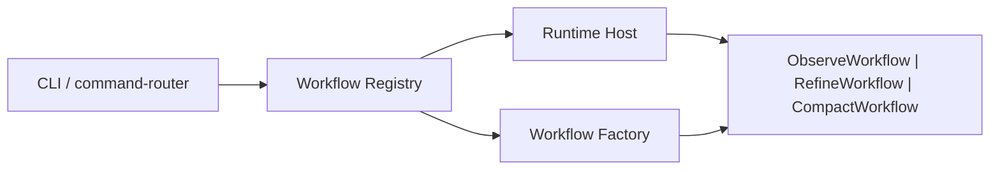

# Workflow Host Boundary Clarification Spec

> Archived historical record. The workflow-host clarification work described here landed on March 21, 2026 and is no longer an active source of truth. The current front-door architecture truth lives in `docs/architecture/overview.md` and `docs/project/current-state.md`.

## Problem

The current `agent-runtime` repository has already completed the large taxonomy migration, but the workflow entry surface is still hard to read:

- `application/shell/runtime-composition-root.ts` mixes shared infrastructure assembly with workflow-specific construction
- `application/providers/` behaves like a catch-all for factory code instead of a stable architectural layer
- `runtime/agent-execution-runtime.ts` is too small and too shell-adjacent to justify `runtime/` as an active long-term directory
- `observe`, `refine`, and `compact` do not yet share one explicit workflow-host model, even though they already behave like distinct workflows

The resulting shape still makes future agents guess:

- what is shared platform/runtime hosting
- what is workflow-specific orchestration
- which files own lifecycle versus execution semantics
- which directories are intended to remain stable versus transitional

This spec freezes a clearer model: unify the outer workflow host, keep workflow semantics separate, and tighten folder ownership around that split.

## Success

- There is one explicit workflow-host boundary for CLI-started workflows.
- `observe` remains a pure recording workflow and is not forced into agent-loop abstractions.
- `refine` remains the only active browser-agent workflow with tool surface, HITL, and knowledge semantics.
- `compact` is represented as a third workflow in the same architectural vocabulary, even if its runtime needs differ from browser-backed workflows.
- `application/providers/` no longer exists as a long-term directory layer.
- `runtime/` is either removed or narrowed to a clearly justified live-session primitive set.
- A future agent can infer folder purpose from location without needing migration history.

## Out Of Scope

- no redesign of `observe` recording semantics
- no redesign of `refine` tool contracts or prompt semantics
- no redesign of `compact` reasoning behavior
- no new product command surface beyond `observe`, `refine`, and `sop-compact`
- no attempt to unify `observe` and `refine` into one executor or one session model

## Current Diagnosis

### 1. Shared Host And Workflow Construction Are Coupled

The current composition root constructs:

- browser lifecycle
- raw MCP client
- refine tool surface
- refine execution context
- refine executor
- observe executor

in one place and in one pass, even when only one command will run.

That makes the composition root too knowledgeable about workflow internals and turns workflow selection into implicit branching inside construction code.

### 2. `providers/` Is A Pattern Bucket, Not A Layer

The current `application/providers/` folder contains:

- tool surface selection
- execution context construction

These are not one coherent architectural tier. They are helper factories with different ownership:

- refine-specific construction should belong to `application/refine/`
- shared host construction should belong to `application/shell/`

Keeping them under `providers/` hides ownership instead of clarifying it.

### 3. `runtime/` Does Not Currently Earn Its Own Directory

`runtime/agent-execution-runtime.ts` is a small lifecycle wrapper around loop initialization, execution, interrupt, and shutdown.

That behavior is currently closer to workflow hosting than to an independently meaningful runtime layer. If `runtime/` is kept, it must hold real long-lived execution-state primitives. If not, this wrapper should move upward into the shell/workflow-host boundary and `runtime/` should disappear again.

### 4. Workflow Vocabulary Is Incomplete

The repository already has three workflows:

- `observe`
- `refine`
- `sop-compact`

But only `observe` and `refine` are partly modeled through `WorkflowRuntime`, and `compact` still enters through a separate direct service path. This keeps the front door mechanically correct but conceptually uneven.

## Critical Paths

1. Define a single workflow-host model that the CLI can use to resolve and run one workflow at a time.
2. Move workflow-specific construction back into each workflow's home directory.
3. Eliminate `application/providers/` as a long-term layer.
4. Decide whether `runtime/` is removed entirely or narrowed to truly durable live-session primitives.
5. Keep `kernel/`, `contracts/`, `domain/`, and `infrastructure/` stable while improving `application/` clarity.

## Frozen Contracts

- Supported workflow commands remain:
  - `observe`
  - `refine`
  - `sop-compact`
- `observe` remains a recording workflow, not an agent-loop workflow.
- `refine` remains the only workflow that owns:
  - refine-react tool surface
  - pre-observation bootstrap
  - HITL pause/resume semantics
  - attention knowledge load/promote behavior
- `compact` remains an offline reasoning workflow over recorded artifacts.
- `kernel/` stays reusable and workflow-agnostic.
- `contracts/` stays as the stable port/interface layer.
- `infrastructure/` stays responsible for concrete external adapters only.

## Target Architecture

### Host And Workflow Split

The repository should adopt this explicit control-flow model:

Meaning:

- `CLI / command-router` parses user intent only
- `Workflow Registry` maps command to one workflow factory
- `Runtime Host` owns shared lifecycle and platform resources
- each workflow factory constructs only the workflow it owns
- each workflow exposes a small common host-facing contract such as:
  - `prepare()`
  - `execute()`
  - `requestInterrupt()`
  - `dispose()`

The host is unified. The workflows are not unified semantically.

### Shared Host Responsibilities

The unified host may own only cross-workflow concerns such as:

- logger
- run id factory
- artifact writer factory or artifact path policy
- raw MCP client factory
- browser lifecycle
- top-level shutdown / interrupt routing

The host must not own:

- refine bootstrap policy
- refine tool surface shape
- observe recording orchestration
- compact reasoning rounds

### Workflow Responsibilities

#### `application/observe/`

Owns:

- recording workflow construction
- recording execution
- SOP trace / draft / asset production
- observe-specific artifact persistence calls

Does not own:

- agent loop
- knowledge guidance
- refine tool surface

#### `application/refine/`

Owns:

- refine workflow construction
- refine bootstrap
- refine tool surface and session model
- refine executor
- HITL resume behavior
- guidance loading and knowledge promotion

Does not own:

- raw MCP transport construction
- browser lifecycle construction
- generic shell lifecycle

#### `application/compact/`

Owns:

- compact workflow construction
- compact session machine
- compact reasoning loop
- compact human clarification cycle

Does not own:

- CLI routing
- workflow registry

## Target Folder Ownership

### Stable Long-Term Directories

- `domain/`
  - product concepts, records, schemas, cross-layer contracts
- `contracts/`
  - ports/interfaces only
- `kernel/`
  - reusable execution kernel only
- `infrastructure/`
  - external adapters only
- `application/shell/`
  - CLI shell, workflow registry, runtime host
- `application/observe/`
  - observe workflow plus support
- `application/refine/`
  - refine workflow plus support
- `application/compact/`
  - compact workflow plus support

### Directories To Remove Or Shrink

#### `application/providers/`

Planned end state: removed.

Relocation rule:

- host-shared construction moves to `application/shell/`
- observe-specific construction moves to `application/observe/`
- refine-specific construction moves to `application/refine/`

#### `runtime/`

Planned end state: one of the following, with option A preferred.

Option A:

- remove `runtime/`
- move `agent-execution-runtime.ts` lifecycle logic into shell host / workflow host code

Option B:

- keep `runtime/` only if it later owns real live-session primitives shared by multiple workflows

This spec does not freeze a fake need for `runtime/` if no durable ownership remains there.

## Recommended Near-Term File Moves

The first cleanup slice should target the most ambiguous files:

- `application/providers/tool-surface-provider.ts`
  - move into `application/refine/` or inline into a refine workflow factory
- `application/providers/execution-context-provider.ts`
  - split by ownership:
    - observe persistence context into `application/observe/`
    - refine knowledge/resume context into `application/refine/`
- `runtime/agent-execution-runtime.ts`
  - move into `application/shell/` as part of a host abstraction, or delete after inlining
- `application/shell/runtime-composition-root.ts`
  - split into:
    - shared host construction
    - workflow registry/factory resolution
    - per-workflow construction owned by each workflow directory

## Architecture Invariants

- The shell may select a workflow, but it may not encode workflow-specific business policy.
- No shared top-level directory may exist purely because several files use a "provider" or "factory" implementation style.
- `observe` and `refine` must not be merged into one mode-flagged executor.
- Shared host abstractions must unify lifecycle and platform resources, not workflow semantics.
- `kernel/` must not import workflow-specific application code.
- `infrastructure/` must not become a second orchestration layer.
- Folder placement is part of the contract: a file's directory should explain its ownership without reading its internals.

## Failure Policy

- Unsupported workflow or command combinations should fail explicitly in the shell.
- If a workflow requires dependencies the host cannot provide, construction should fail early with direct error context.
- No generic fallback path should auto-downgrade `refine` into `observe`, or vice versa.
- No compatibility abstraction should be kept alive only to preserve an unclear directory model.
- `runtime/` should not be preserved out of caution alone; it should remain only if it has clear durable ownership.

## Acceptance

- A new reader can explain the difference between:
  - shell host
  - workflow
  - kernel
  - infrastructure
  from file location alone.
- `application/providers/` is gone or clearly marked transitional with a removal plan.
- `runtime/` is either removed or reduced to explicitly justified live-session primitives.
- `observe`, `refine`, and `compact` are all described as workflows under one front-door model.
- composition code constructs only the selected workflow instead of eagerly building multiple workflow trees.
- repo architecture docs can describe the front door without referring to migration history or hidden caveats.

## Deferred Decisions

- whether `compact` should eventually use the same runtime-host interface as browser-backed workflows, or a smaller sibling host contract
- whether artifact persistence should later split from one large `ArtifactsWriter` into workflow-specific sinks
- whether `application/refine/` should be further split into subfolders such as `bootstrap/`, `tooling/`, and `session/`
- whether future live-session primitives justify reintroducing a meaningful `runtime/` directory
