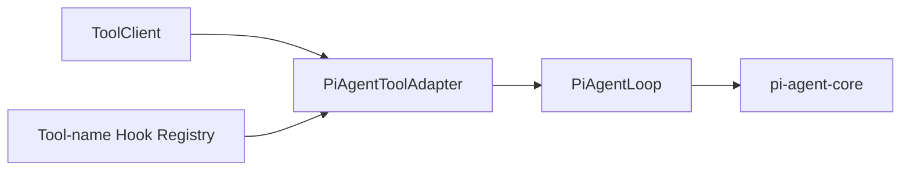
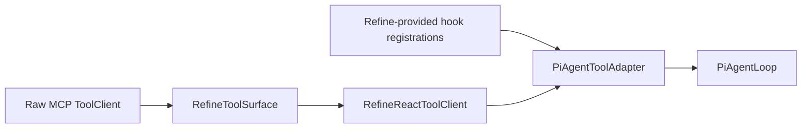

# Pi-Agent Hook Adapter Refactor Design

## Problem

The current execution-kernel naming and hook ownership no longer match the active architecture.

Today:

- `agent-loop.ts` is specifically the loop around `pi-agent-core`, but its name is generic
- `mcp-tool-bridge.ts` is no longer an MCP transport bridge in the active refine path
- the active refine workflow passes a refine-owned `ToolClient` facade into the kernel, not a raw MCP client
- hook behavior is expressed twice:
  - as refine-native before/after tool hooks on `RefineToolSurface`
  - as a bridge observer seam adapted back into `McpToolBridge`
- bridge hook execution still relies on hardcoded tool classification instead of explicit registration

This leaves two architecture problems:

- the kernel file names lie about their actual role
- hook behavior is modeled as a bridge concern instead of a `pi-agent` execution concern

## Success

- `agent-loop.ts` is renamed to `pi-agent-loop.ts`
- `mcp-tool-bridge.ts` is renamed to `pi-agent-tool-adapter.ts`
- the adapter is explicitly responsible for:
  - converting `ToolClient` tool definitions into `pi-agent-core` `AgentTool` objects
  - executing underlying `ToolClient.callTool(...)`
  - running registered `before/after` hooks for the matching `toolName`
  - converting the final `ToolCallResult` into the `pi-agent-core` response shape
- hook execution happens only on the `pi-agent` tool execution path
- direct programmatic `ToolClient.callTool(...)` usage does not trigger hook behavior
- hook registration is keyed by `toolName`, not by preclassified tool kind
- hook implementations can modify the final tool result returned to `pi-agent-core`
- kernel no longer owns refine-specific tool semantics such as mutation/observation classification

## Out Of Scope

- no change to refine-facing tool names or schemas
- no change to refine bootstrap semantics other than removing hook coupling
- no change to raw MCP transport ownership in `infrastructure/mcp/`
- no cross-workflow hook system for `observe` or `sop-compact`
- no new generic middleware abstraction beyond the needs of `pi-agent` tool execution

## Current Diagnosis

### 1. `McpToolBridge` No Longer Describes The Active Runtime Shape

In the active refine path, `AgentLoop` does not receive a raw MCP client. It receives a refine-owned `ToolClient` facade assembled from the refine tool surface.

That means the file currently named `mcp-tool-bridge.ts` is actually doing:

- `ToolClient` to `AgentTool[]` adaptation
- tool execution wrapping
- result shaping
- hook dispatch

The filename suggests a transport concern, but the file now owns execution adaptation for `pi-agent-core`.

### 2. Hook Ownership Is Split Across Two Seams

The active refine architecture has:

- a refine-native hook pipeline on `RefineToolSurface`
- a second hook seam in `McpToolBridge`, fed by an observer adapter

These two seams currently share one logical pipeline, so behavior is not fully forked, but the ownership story is still unclear:

- direct `toolClient.callTool(...)` uses one seam
- `pi-agent-core` tool execution uses the other seam

The result is duplicate modeling of the same cross-cutting concern.

### 3. Kernel Hook Policy Still Depends On Hardcoded Tool Classification

`McpToolBridge` currently decides whether hooks should run by classifying tool names into:

- `mutation`
- `observation`
- `meta`

That classification is hardcoded around raw browser tool names and action variants. This no longer matches the intended boundary:

- hook behavior should be a `pi-agent` execution concern
- whether a hook runs should be explicit and local to the tool name being targeted
- refine should not need kernel-side preclassification just to customize post-processing

### 4. Direct Tool Calls Should Not Implicitly Inherit Pi-Agent Hook Semantics

Refine bootstrap and other programmatic flows call `ToolClient.callTool(...)` directly.

Those flows are not `pi-agent-core` execution and should not accidentally inherit the same hook semantics. Keeping hook behavior at the generic `ToolClient` level makes the boundary blurrier and makes tests less explicit.

## Frozen Decisions

The following decisions are approved and fixed for this refactor:

- rename `AgentLoop` to `PiAgentLoop`
- rename `McpToolBridge` to `PiAgentToolAdapter`
- hook behavior is only for the `pi-agent-core` execution path
- no explicit hook support is kept on direct `ToolClient.callTool(...)`
- hooks are registered by exact `toolName`
- hooks use a two-phase `before + after` lifecycle
- hooks may modify the final `ToolCallResult` returned to `pi-agent-core`

## Target Architecture

### Core Shift

This refactor changes hook ownership from:

- generic bridge policy attached to a tool transport abstraction

to:

- explicit `pi-agent` tool execution policy attached to the `ToolClient -> AgentTool` adapter

### Target Shape



In the refine path:



Important boundary:

- `RefineToolSurface.callTool(...)` remains a direct tool call path
- `PiAgentToolAdapter` is the only place where `pi-agent` execution hooks run

## Target Interfaces

### `PiAgentToolAdapter`

`PiAgentToolAdapter` owns:

- `buildAgentTools(): Promise<AgentTool[]>`
- tool schema normalization
- execution wrapping for `AgentTool.execute(...)`
- running registered hooks for the current `toolName`
- converting the final `ToolCallResult` into the `pi-agent-core` response shape

It does not own:

- MCP transport lifecycle
- refine session semantics
- tool kind classification
- direct `ToolClient.callTool(...)` interception

### Hook Registry

Hooks are registered by exact tool name:

```ts
type PiAgentToolHookRegistry = Map<string, PiAgentToolHook[]>;
```

No wildcard, category, or classifier-based registration is introduced in this pass.

This keeps the rule easy to understand:

- no registration for a tool name means no hook for that tool
- registration is explicit and local

### Hook Lifecycle

Each hook supports:

```ts
interface PiAgentToolHook {
  before?(context: PiAgentToolExecutionContext): Promise<unknown>;
  after?(
    context: PiAgentToolExecutionContext,
    result: ToolCallResult,
    capture: unknown,
  ): Promise<ToolCallResult | void>;
}
```

Execution order:

1. adapter resolves hooks for the current `toolName`
2. adapter runs `before` in registration order and stores captures
3. adapter calls the underlying `ToolClient.callTool(...)`
4. adapter runs `after` in registration order using the evolving result value
5. adapter converts the final result into the `AgentTool.execute(...)` return shape

This gives hooks a clear and explicit way to transform the final result without introducing adapter-private patch fields.

### Execution Context

The kernel context passed to hooks should be `pi-agent` oriented and minimal.

Target shape:

```ts
interface PiAgentToolExecutionContext {
  toolName: string;
  toolCallId: string;
  args: Record<string, unknown>;
  runtimeContext?: Record<string, unknown>;
}
```

This avoids freezing refine-specific fields into the kernel API.

If refine needs run-scoped metadata, it can populate `runtimeContext` when wiring the loop, but kernel does not define page/session semantics itself.

## Refine Integration

### Hook Source Of Truth

Refine should keep one canonical hook logic source and expose it to `PiAgentToolAdapter` as tool-name registrations.

That means refine should stop treating:

- surface hook execution
- bridge observer execution

as two equivalent ownership models.

Instead:

- refine owns hook logic
- refine exports adapter-compatible hook registrations
- `PiAgentToolAdapter` is the only runtime that executes those hooks

### Bootstrap Behavior

Direct bootstrap calls like `observe.page` remain direct `ToolClient.callTool(...)` usage and do not trigger `pi-agent` hooks.

This is intentional:

- bootstrap is orchestration logic, not `pi-agent-core` tool execution
- tests for bootstrap should not require hidden hook effects
- future direct tool users should get plain tool semantics unless they are explicitly running through `PiAgentToolAdapter`

## Migration Plan

### Step 1. Rename Kernel Files And Symbols

- rename `AgentLoop` to `PiAgentLoop`
- rename `McpToolBridge` to `PiAgentToolAdapter`
- update imports, tests, and front-door docs accordingly

### Step 2. Replace Bridge Observer API With Tool-Name Hook Registration

- remove `McpToolCallHookObserver`
- remove bridge-specific hook context types that exist only for the old observer seam
- introduce `PiAgentToolHook` and a tool-name hook registry
- update the adapter to use this registry during `AgentTool.execute(...)`

### Step 3. Remove Kernel Tool Classification

- delete mutation/observation/meta classification
- delete the raw browser tool name tables used only for hook gating
- delete `hookOrigin` handling and bridge-internal arg stripping

### Step 4. Simplify Refine Hook Wiring

- replace refine's bridge observer adapter with a refine-to-adapter hook registration adapter
- stop modeling direct `RefineToolSurface.callTool(...)` as a hook-triggering path for this concern
- keep refine hook logic itself intact where possible, but move its runtime entrypoint to the adapter registration boundary

### Step 5. Update Tests And Architecture Docs

- rename kernel tests to `pi-agent-*`
- cover adapter hook behavior directly through `AgentTool.execute(...)`
- document that `pi-agent` hooks are execution-path-only, not generic `ToolClient` behavior

## Verification Expectations

The refactor is complete only when the following are covered:

- adapter unit tests prove:
  - hooks run only for registered tool names
  - `before` and `after` both run in order
  - `after` can replace the final `ToolCallResult`
  - unregistered tools bypass hooks
- refine integration tests prove:
  - refine hook registrations wire into `PiAgentToolAdapter`
  - direct `RefineReactToolClient.callTool(...)` does not trigger `pi-agent` hooks
- workflow tests prove:
  - `PiAgentLoop` still initializes and runs tools through the adapter
  - existing refine loop behavior remains intact after the rename

Project gates remain:

- `npm --prefix apps/agent-runtime run lint`
- `npm --prefix apps/agent-runtime run test`
- `npm --prefix apps/agent-runtime run hardgate`
- `npm --prefix apps/agent-runtime run typecheck`
- `npm --prefix apps/agent-runtime run build`

## Risks

### 1. Hidden Dependence On Old Bridge Hook Types

Some refine tests or helper code may still depend on bridge-specific observer names or context shapes. The implementation pass should update those references deliberately instead of preserving compatibility shims.

### 2. Accidental Hook Execution On Direct Calls

If refine hook logic is left on `RefineToolSurface.callTool(...)` while also being wired into `PiAgentToolAdapter`, the same concern will continue to exist in two places. The implementation pass must remove that ambiguity rather than keeping both paths alive.

### 3. Over-Generalizing The Registry

This pass should not introduce pattern matching, wildcard registration, or tool categories. Exact `toolName` registration is the approved boundary.

## Done Definition

This refactor is done when:

- kernel file and symbol names match their actual `pi-agent` ownership
- `PiAgentToolAdapter` is the only place where `pi-agent` tool hooks execute
- hooks are registered by exact `toolName`
- direct `ToolClient.callTool(...)` remains hook-free
- old bridge observer and tool-classification logic is removed
- docs and tests are updated to the new boundary
