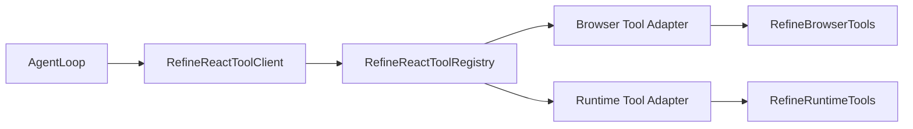
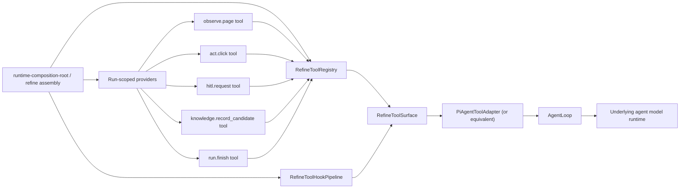

# Refine Tool Surface Unification Design

## Problem

The current `refine` tool surface already presents one unified `ToolClient` contract to the agent, but the internal ownership model is still fragmented.

Today:

- `RefineReactToolClient` assembles two adapter families, `browser` and `runtime`, inside its own constructor
- each adapter owns a group of tool names, descriptions, schemas, and dispatch logic
- tool behavior lives in one file while tool metadata lives in another
- argument parsing and tool dispatch are implemented through adapter-local `switch` branches
- run-scoped dependencies such as `session` and `hitlAnswerProvider` are mutated into the tool system after construction
- workflow/bootstrap code still knows specific tool names such as `observe.page`

This leaves the system in an awkward middle state:

- agent-facing tools are unified, but implementation ownership is still adapter-centric
- registry exists, but tool definition ownership is split across domain constants, adapter metadata tables, and executor/bootstrap code
- adapters are doing both low-level capability adaptation and high-level tool registration
- adding or changing a tool requires editing several disconnected places

The result is harder maintenance and weaker architectural clarity exactly in the part of the runtime that now matters most for refine stability.

## Success

- `refine` keeps the same 12 agent-facing tool names and contracts:
  - `observe.page`
  - `observe.query`
  - `act.click`
  - `act.type`
  - `act.press`
  - `act.navigate`
  - `act.select_tab`
  - `act.screenshot`
  - `act.file_upload`
  - `hitl.request`
  - `knowledge.record_candidate`
  - `run.finish`
- each tool becomes a first-class definition that owns:
  - `name`
  - `description`
  - `inputSchema`
  - invocation behavior
- browser control, HITL access, knowledge recording, and finish/session mutation are exposed to tools through run-scoped providers/context rather than adapter-local switch logic
- registry owns only registration, uniqueness checks, ordering, and name lookup
- one explicit tool-surface/execution layer owns the unified `list/call` entrypoint for refine
- one explicit hook pipeline owns before/after interception instead of hiding it inside a misleading bridge abstraction
- workflow/bootstrap code no longer depends on browser-vs-runtime adapter distinctions and mutable injection details are reduced to one explicit refine-owned context boundary
- schema/description ownership is colocated with the tool definition instead of hardcoded in separate adapter metadata tables
- current raw MCP integration and `AgentLoop` integration continue to work without changing the agent-visible contract

## Out Of Scope

- no change to the 12 refine-agent-facing tool contracts
- no renaming, merging, or removal of existing refine tool names
- no redesign of prompt semantics or run success semantics
- no cross-workflow tool system for `observe` or `sop-compact` in this pass
- no broad rewrite of raw MCP transport or browser launch lifecycle
- no change to current knowledge ranking policy
- no change to current HITL interaction policy beyond dependency injection cleanup

## Current Diagnosis

### 1. Tools Are Unified At The Boundary, But Not In Ownership

`ToolClient` already gives the agent one clean interface:

- `listTools()`
- `callTool(name, args)`

But the internal assembly still treats tools as belonging to adapter groups rather than being first-class objects.

Current shape:



This means the actual unit of organization is still the adapter, not the tool.

Note:

- `McpToolBridge` is an internal kernel detail owned by `AgentLoop`
- it is not an agent-facing tool interface and it is not part of the refine tool-surface boundary

### 2. Tool Definition Ownership Is Split Across Too Many Files

The active refine tool surface is currently split across at least four layers:

- the frozen tool ordering constant in `domain/refine-react.ts`
- browser tool descriptions and schemas in `refine-react-browser-tool-adapter.ts`
- runtime tool descriptions and schemas in `refine-react-runtime-tool-adapter.ts`
- invocation behavior in `refine-browser-tools.ts` and `refine-runtime-tools.ts`

This makes drift likely:

- behavior changes can forget schema changes
- schema changes can forget description changes
- new tools require synchronized edits in multiple locations
- tests have to verify wiring rather than one canonical definition object

### 3. Adapters Currently Mix Two Different Responsibilities

Right now each adapter does both:

- low-level capability adaptation
- high-level tool registration and dispatch

Those are different jobs.

Examples:

- `RefineReactBrowserToolAdapter` adapts raw browser MCP calls, but also owns refine tool metadata and agent-visible dispatch
- `RefineReactRuntimeToolAdapter` adapts session/HITL/knowledge behavior, but also owns agent-visible metadata and dispatch

This is the main architecture smell behind the current maintenance cost.

### 4. Run-Scoped Dependency Injection Is Mutable And Leaky

The current refine tool system mutates runtime state into the tool client after construction:

- `setSession(...)`
- `setHitlAnswerProvider(...)`

That is workable, but it exposes the lifecycle shape of the tool system to bootstrap code and registry code.

It also means the runtime has to remember which dependencies are construction-time and which are later patched in.

### 5. Business Code Still Knows Specific Tool Names

`RefineRunBootstrapProvider` currently calls `observe.page` directly during bootstrap so it can load page-scoped guidance before the loop starts.

That behavior itself is valid, but it reveals a missing abstraction:

- bootstrap is depending on a named tool string
- rather than depending on a clearly owned capability such as "initial observation provider"

This is not the biggest problem today, but it is a strong signal that tool invocation and business orchestration are still too tightly coupled.

### 6. Hook Classification Still Reflects Raw MCP Shape

`McpToolBridge` still classifies tools using raw MCP browser names such as:

- `browser_click`
- `browser_navigate`
- `browser_snapshot`

That made sense before the refine surface was elevated, but the current agent-facing surface is:

- `act.click`
- `act.navigate`
- `observe.page`

In the active refine path this is not only a conceptual mismatch. `AgentLoop` receives `RefineReactToolClient`, so `McpToolBridge` is currently seeing refine tool names like `act.click` and `observe.page` while its classifier still recognizes only raw browser names such as `browser_click` and `browser_snapshot`. That means refine-facing tools currently fall through to `meta` classification instead of `mutation` or `observation`.

This spec does not broaden bridge scope in this pass, but the new design must explicitly preserve current behavior and avoid assuming the existing hook classification is already aligned.

## Frozen Contracts

The following remain unchanged in this refactor:

- refine still exposes exactly 12 tools to the agent
- tool names remain in the same order as today
- tool request/response shapes remain compatible with the current tests and current bootstrap/executor callers
- `RefineReactSession` remains the canonical run-scoped state owner for observations, actions, pause state, finish state, and candidate knowledge
- `RefineReactToolClient` remains responsible for the active refine-only workflow contract methods currently consumed outside bare `ToolClient`:
  - `setSession(...)`
  - `setHitlAnswerProvider(...)`
  - `getSession()`
- `RefineRuntimeTools` semantics remain unchanged:
  - `hitl.request` may answer immediately or pause the run
  - `knowledge.record_candidate` records candidate knowledge with provenance
  - `run.finish` is still required for normal success/failure closure
- `RefineBrowserTools` semantics remain unchanged:
  - browser observation/action logic remains refine-owned
  - source observation checks and screenshot compatibility fallbacks remain explicit
  - screenshot capability negotiation remains explicit:
    - probe available raw screenshot tool names
    - try compatible output-argument variants
    - preserve current fallback ordering semantics
  - live-tab validation continues to tolerate `browser_tabs` lookup failure by degrading to empty live-tab knowledge rather than inventing fallback browser state
- `McpToolBridge` still consumes one `ToolClient`
- `AgentLoop` still consumes one `ToolClient`

## Target Architecture

### Core Shift

This refactor changes the unit of ownership from:

- "adapter owns a group of tools"

to:

- "tool owns its own contract and behavior"

Adapters/providers still exist, but only as low-level capability wrappers used by tools.

### Target Shape



### Tool Is The First-Class Unit

Each refine tool should be represented by one definition object.

Minimal target contract:

```ts
interface RefineToolDefinition {
  readonly name: string;
  readonly description: string;
  readonly inputSchema: Record<string, unknown>;
  invoke(args: Record<string, unknown>, context: RefineToolContext): Promise<ToolCallResult>;
}
```

Notes:

- exact type names may differ in implementation
- one tool definition is responsible for one agent-visible tool
- schema/description/invoke live together
- registry does not own tool business logic

### Providers Replace Adapter-Centric Grouping

The new run-scoped tool context should expose providers such as:

```ts
interface RefineToolContext {
  browser: RefineBrowserProvider;
  runtime: RefineRuntimeProvider;
  session: RefineReactSession;
}
```

Provider meaning:

- `browser` adapts access to raw browser/MCP-backed capabilities needed by refine browser tools
- `runtime` adapts access to HITL answer handling, finish mutation, and knowledge recording behavior
- `session` remains explicit because many tool semantics are directly session-scoped

Important constraint:

- providers are low-level dependencies
- providers do not decide which tool names exist
- providers do not expose `listTools()` or `callTool(name, args)`

This is the intended meaning of "adapter/provider退化":

- adapters do not disappear
- adapters stop being the primary unit of tool organization
- adapters become narrow capability wrappers consumed by first-class tools

Provider constraints in this pass:

- browser-facing providers must preserve current raw-tool compatibility behavior rather than collapsing to one fake stable primitive
- runtime-facing providers must preserve current pause/finish/knowledge semantics against `RefineReactSession`
- provider APIs may stay somewhat imperative if that is what preserves current refine behavior with the least risk

### Registry Responsibilities

The refine registry should own only:

- registration of tool definitions
- duplicate-name protection
- ordered exposure of tool definitions
- name-to-tool lookup for invocation

It should not own:

- argument parsing policy for each tool
- tool metadata tables in separate constants
- browser/runtime grouping semantics
- session/HITL mutation APIs

Minimal target contract:

```ts
interface RefineToolRegistry {
  listDefinitions(): RefineToolDefinition[];
  get(name: string): RefineToolDefinition | undefined;
}
```

Internally it may use:

- `Map<string, RefineToolDefinition>`
- an ordered array of tool names
- an ordered array of definitions

But it should never need adapter-specific `switch` logic.

Lifecycle note:

- current registry owns adapter connect/disconnect sequencing plus partial-connect rollback
- this pass must re-home that lifecycle ownership explicitly if registry is narrowed
- acceptable owners are:
  - the refine tool surface facade
  - a dedicated lifecycle coordinator under refine tooling

What is not acceptable is silently dropping the current rollback guarantee.

### Tool Surface And Execution Responsibilities

The current `RefineReactToolClient` should evolve from:

- constructor that knows which adapters exist

to:

- thin refine-specific tool surface facade over:
  - registry
  - run-scoped tool context
  - hook pipeline

Meaning:

- refine assembly creates providers/context
- refine assembly creates tool definitions
- registry registers those tools
- hook pipeline wraps invocation before and after execution
- tool surface exposes the unified `list/call` contract used by the rest of refine
- any `ToolClient` compatibility should be an outward-facing facade over this surface, not the conceptual center of the design

This keeps the current external contract while making the internal ownership model much clearer.

However, the active refine workflow has an important pre-bootstrap lifecycle constraint:

- `RefineReactToolClient` is created before the real run session exists
- `AgentLoop.initialize()` connects the tool client during workflow `prepare()`
- only later does bootstrap install the real run session and HITL answer provider

So the target shape must still support:

- connect-before-real-session
- later swap-in of run-scoped context
- rollback on partial connect failure

This is why the target design is not "purely immutable construction". It is "single owned mutable context boundary" rather than "several adapter mutation points".

### Hook Pipeline Responsibilities

The current before/after interception behavior should become an explicit hook concern rather than an accidental side-effect of a bridge class name.

Minimal target contract:

```ts
interface RefineToolHookPipeline {
  beforeCall?(context: RefineToolHookContext): Promise<RefineToolHookCapture | null>;
  afterCall?(
    context: RefineToolHookContext,
    result: ToolCallResult,
    before: RefineToolHookCapture | null
  ): Promise<RefineToolHookCapture | null>;
}
```

Rules:

- tool hooks are execution-time concerns
- tool hooks are independent from tool registration
- tool hooks are independent from `pi-agent` adaptation
- origin tagging such as `tool_call` versus `hook_internal` remains a hook/execution concern, not a registry concern

### Pi-Agent Adapter Responsibilities

The current runtime still needs one layer that exposes refine tools to `AgentLoop` in the format expected by `pi-agent-core`.

That layer should be treated as a narrow runtime adapter:

- it consumes the refine tool surface
- it builds the executable tool wrappers needed by `AgentLoop`
- it should not own refine tool semantics
- it should not own hook policy
- it should not own registry policy

For this pass, that adapter may continue to be implemented by the current `McpToolBridge` or an equivalent renamed wrapper. The important change is conceptual ownership, not forced renaming in the same pass.

## Detailed Design

### 1. Split Capability Providers From Tool Definitions

Create refine-owned provider abstractions that wrap the current helper classes without changing current behavior.

Provider examples:

- browser provider backed by current `RefineBrowserTools` internals or a decomposed subset of them
- runtime provider backed by current `RefineRuntimeTools`

The key rule is:

- provider method names should describe capabilities
- provider method names should not be agent-facing tool names unless that is truly the canonical business capability

For example, bootstrap may legitimately depend on an "initial observation" capability, but that should be surfaced as a provider capability rather than hardcoding a registry string call if we can do so without changing semantics.

Important compatibility constraint:

- browser providers must carry forward today's raw-tool negotiation behavior, especially screenshot capability probing and tab-state reads
- this pass must not assume every refine browser action maps to one stable raw primitive

### 2. Move Tool Metadata Next To Tool Logic

For every refine tool:

- define `name`
- define `description`
- define `inputSchema`
- implement `invoke`

in the same module or tightly colocated module cluster.

This removes the current split where:

- descriptions/schemas live in adapter constants
- behavior lives in helper classes

That colocation is the most important maintainability improvement in this refactor.

### 3. Replace Adapter `switch` Dispatch With Name-Keyed Registration

The current `switch(name)` pattern should be removed from refine tool dispatch.

Target behavior:

- each tool definition registers itself by `name`
- registry looks up the tool by name
- registry invokes the tool directly

This can be implemented with:

- one array of tool definitions
- one `Map<string, RefineToolDefinition>`

No adapter-level tool dispatch table should remain in the active path.

### 4. Add An Explicit Tool Surface Layer

The refine runtime should have one explicit surface/executor layer that owns:

- listing tool definitions as agent-visible metadata
- resolving one tool by name
- invoking that tool with run-scoped context
- routing the invocation through the hook pipeline

This is the real unified tool entrypoint for refine.

Whether it outwardly implements today's `ToolClient` interface is a compatibility choice, not its core architectural identity.

### 5. Keep Ordering Frozen Without Making Domain Own Tool Metadata

The current refine surface has a frozen order requirement.

That should remain explicit, but the ordering constant must not continue to imply that domain owns tool metadata.

Recommended direction:

- keep one refine-owned ordered tool-name list only as ordering/frozen contract data
- validate that every ordered tool name has a matching registered definition
- keep actual description/schema/invoke ownership inside the tool definitions

That means order remains explicit, but metadata and behavior move back to the tool.

### 6. Clean Up Run-Scoped Injection

Current refine tooling exposes mutable lifecycle hooks:

- `setSession`
- `setHitlAnswerProvider`

The target design should move toward one run-scoped context object created per refine run/bootstrap session.

Acceptable intermediate shape:

- tool surface is created once
- run-scoped context object is swapped atomically when bootstrap sets a new session

Preferred end shape for this pass:

- tool surface owns a small mutable `RefineToolContextRef`
- bootstrap updates one context reference rather than mutating adapter families separately

This keeps behavior unchanged while making the lifecycle boundary much easier to reason about.

Additional required rule:

- `RefineReactToolClient` still exposes `setSession`, `setHitlAnswerProvider`, and `getSession` in this pass, even if those become thin wrappers over a context owner

That is necessary because bootstrap and run execution already depend on those methods today.

### 7. Preserve Existing Bootstrap Semantics While Narrowing Coupling

Bootstrap still needs:

- run id resolution
- session creation
- pre-observation for page-scoped guidance load
- HITL answer provider wiring

This pass does not need to fully eliminate bootstrap's use of `observe.page`, but it should move the design in a direction where bootstrap depends on a refine-owned capability boundary rather than on adapter-specific mutation methods.

Target principle:

- business orchestration should depend on refine capabilities
- not on knowledge of browser-vs-runtime adapter internals

### 8. Keep The Current Pi-Agent Adapter Stable

The current `McpToolBridge` remains an internal `AgentLoop` implementation detail in the active codebase.

In current code it does more than simple format conversion:

- enumerates `ToolClient` definitions and builds `AgentTool` wrappers
- normalizes/sanitizes input schema before exposing it to the underlying agent runtime
- wraps each tool execution with the current hook lifecycle
- strips bridge-internal arguments such as hook origin metadata
- rewrites the tool result into the text/details shape expected by the current agent loop integration

So this bridge should be understood as an `AgentLoop`-internal tool execution wrapper, not as:

- a refine business boundary
- a raw MCP transport boundary
- a pure one-line format adapter

For this pass, `AgentLoop` should continue to consume the same kernel-facing tool contract and continue to own this adapter internally.

This spec does not require:

- changing `AgentLoop`
- changing the current kernel-facing tool contract in the same pass unless implementation finds that a compatibility facade is cleaner
- changing raw MCP client behavior outside whatever the refine tool surface already wraps today

The current bridge or its immediate replacement should simply see a cleaner refine tool surface underneath it.

That lets this refactor stay refine-local and low-risk.

Clarification:

- the bridge's current tool classification mismatch is real and pre-existing
- this refactor does not need to solve it
- but verification must ensure the refactor does not regress existing hook behavior or accidentally rely on the bridge already understanding refine tool names

## Proposed Module Shape

One valid target shape is:

```text
apps/agent-runtime/src/application/refine/
  tools/
    definitions/
      observe-page-tool.ts
      observe-query-tool.ts
      act-click-tool.ts
      act-type-tool.ts
      act-press-tool.ts
      act-navigate-tool.ts
      act-select-tab-tool.ts
      act-screenshot-tool.ts
      act-file-upload-tool.ts
      hitl-request-tool.ts
      knowledge-record-candidate-tool.ts
      run-finish-tool.ts
    providers/
      refine-browser-provider.ts
      refine-runtime-provider.ts
      refine-tool-context.ts
    refine-tool-registry.ts
    refine-tool-surface.ts
```

This exact folder structure is not mandatory.

What is mandatory is the ownership split:

- tool definitions are first-class
- providers are low-level capabilities
- registry is registration/invocation only

## Migration Plan

### Phase 1. Freeze The Contracts

- keep all 12 tool contracts unchanged
- keep current ordering unchanged
- keep current tests as regression locks
- explicitly freeze response-shape contracts that current bootstrap and runtime code depend on, not only input schemas
- explicitly freeze current lifecycle behavior:
  - client may connect before real run session exists
  - bootstrap later installs run-scoped session/HITL context
  - partial-connect rollback remains guaranteed

### Phase 2. Introduce First-Class Tool Definitions

- add tool definition objects/classes for all 12 refine tools
- colocate `name`, `description`, `inputSchema`, and invocation behavior
- keep current helper logic underneath where practical

### Phase 3. Introduce Provider/Context Layer

- wrap current browser/runtime helper behavior behind run-scoped providers
- make tool definitions depend on provider/context instead of adapter-local helpers
- preserve current raw browser compatibility negotiation inside browser-facing providers

### Phase 4. Introduce Tool Surface And Hook Pipeline

- introduce one explicit refine tool surface that owns unified `list/call`
- introduce one explicit hook pipeline that owns before/after interception
- keep hook ownership out of registry and out of the `pi-agent` adapter

### Phase 5. Replace Adapter Dispatch

- remove adapter-local `switch(name)` dispatch
- register tool definitions directly into the refine registry
- route execution through the tool surface and hook pipeline
- keep registry lookup/order checks

### Phase 6. Narrow Tool Client Construction

- make `RefineReactToolClient` a thin compatibility facade over the refine tool surface
- remove direct knowledge of browser/runtime adapter families from the active path
- keep `setSession`, `setHitlAnswerProvider`, and `getSession` as the stable refine-workflow-facing facade until callers are intentionally redesigned in a later pass

### Phase 7. Keep The Current Pi-Agent Adapter Thin

- keep the current `AgentLoop` integration stable
- keep `McpToolBridge` or its immediate replacement narrow and `AgentLoop`-owned
- do not let the `pi-agent` adapter absorb registry or hook responsibilities

### Phase 8. Narrow Bootstrap Coupling

- reduce bootstrap interaction with tool surface mutation details
- move toward one run-scoped context update boundary

## Risks

### 1. Hidden Contract Drift

Because current tests already freeze several schemas and behaviors, moving metadata and invocation together may accidentally alter:

- required fields
- enum values
- returned shape details
- tool ordering
- bootstrap-visible observation payload details
- executor-visible session access behavior

Mitigation:

- preserve and extend existing refine tool client contract tests before deleting old dispatch code

### 2. Over-Abstracting Providers

It would be easy to replace one bad grouping with another large generic provider that simply recreates the same indirection under a new name.

Mitigation:

- providers stay narrow and capability-focused
- no provider owns `listTools()` or `callTool(name, args)`

### 3. Half-Migrated Lifecycle State

If the refactor keeps both:

- tool-specific first-class context
- old adapter mutation methods

for too long, lifecycle reasoning may become more confusing, not less.

Mitigation:

- introduce a clear target context owner early
- remove obsolete adapter lifecycle hooks as soon as the replacement is wired

### 4. Bridge Semantics Leakage

The raw-MCP-centric hook classification in `McpToolBridge` may remain conceptually awkward after tool unification.

Mitigation:

- do not expand bridge responsibility in this pass
- keep bridge stable and revisit refine-surface-aware hook semantics only if needed after the refactor lands
- treat current refine-tool-to-`meta` classification as existing technical debt, not as a solved baseline

## Verification Strategy

Before claiming this refactor complete:

- existing refine tool client contract tests must still pass
- existing refine workflow assembly tests must still pass
- bootstrap tests must still pass
- no agent-visible tool schema drift is allowed
- `listTools()` must still expose the same 12 names in the same order
- current bootstrap consumers must still be able to parse `observe.page` output without adaptation regressions
- `RefineReactToolClient` workflow-facing methods must still support bootstrap and executor callers
- current connect/disconnect rollback guarantees must still hold
- add or preserve a targeted regression test around current `McpToolBridge` / refine-tool hook behavior so the refactor cannot silently worsen the existing classification mismatch
- `McpToolBridge` and `AgentLoop` integration must continue to work without API changes

Quality gates remain:

- `npm --prefix apps/agent-runtime run lint`
- `npm --prefix apps/agent-runtime run test`
- `npm --prefix apps/agent-runtime run hardgate`
- `npm --prefix apps/agent-runtime run typecheck`
- `npm --prefix apps/agent-runtime run build`

## Decision

This spec chooses the following direction for the refine-only pass:

- keep the current agent-facing refine tool surface unchanged
- promote each refine tool into a first-class definition that owns its own contract and invoke behavior
- demote adapters/providers into narrow low-level capability wrappers
- keep registry small and mechanical
- keep workflow and bridge contracts stable

This is the smallest refactor that resolves the current ownership split without broadening scope into `observe` or `sop-compact`.
