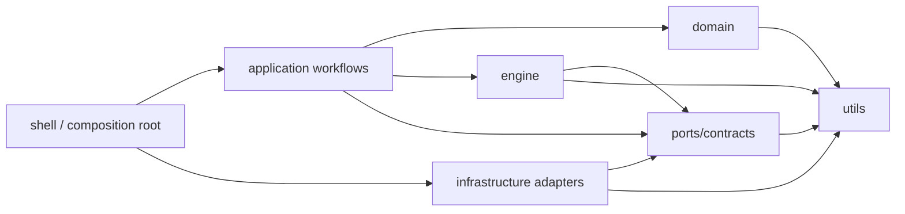

# Agent Runtime OpenAI-Style Layer Model Design

## Status
- Proposed
- Date: 2026-03-23

## Context

The current `apps/agent-runtime/src` tree has a partial architecture lint and a partially clarified directory taxonomy, but the dependency graph is still wider than the intended long-term maintenance model.

The current codebase already improved several migration-era boundaries:

- `src/runtime/*` and `src/core/*` are no longer part of the active front door
- `application/shell/runtime-composition-root.ts` is the active assembly owner
- workflow entrypoints are concentrated under `application/{observe,compact,refine}`
- `refine/tools/*` has been split into multiple directories

However, the active dependency surface is still too broad for an OpenAI Harness-style maintenance model:

- `kernel/*` still carries product-facing semantics and special-case dependencies
- `application/*` still imports concrete infrastructure in many places
- workflow modules still have more direct infrastructure knowledge than the desired end state
- `refine/tools/*` is directory-partitioned, but not yet governed by a hard role model

This design freezes a stronger target model for `src/` only. It is intentionally stricter than the current code so future lint and structural tests can ratchet the repo toward a narrower and more predictable dependency graph.

## Goals

- Freeze a canonical `src/` layer model that is closer to the narrow, one-way dependency style described in OpenAI Harness engineering
- Define which code belongs to `domain`, `ports/contracts`, `engine/kernel`, `application`, `infrastructure`, and `utils`
- Define a finer-grained role model for `application/*`, especially `application/refine/tools/*`
- Separate the end-state architecture from the first migration slice
- Prepare the repo for future hard gates in lint and structural tests

## Non-Goals

- Immediate full refactor of the current codebase
- Renaming every directory in one pass
- Replacing all current contracts with Zod or another schema tool
- Reworking `scripts/`, `test/`, or docs outside the `src/` architecture model in this design

## Terminology

- `A -> B` means code in `A` may import code in `B`
- `layer` means a top-level architectural bucket under `src/`
- `sublayer` means a constrained role bucket inside a top-level layer
- `role` means a file-kind classification with explicit allowed imports
- `end state` means the target architecture we want to ratchet toward
- `phase 1` means the first migration slice we can realistically implement from the current baseline

## Source Scope

This design applies only to:

- `apps/agent-runtime/src/**`

It does not yet redefine the architecture rules for:

- `apps/agent-runtime/scripts/**`
- `apps/agent-runtime/test/**`
- repo-root docs outside their role as documentation truth

## Design Principles

### 1. Narrow edges beat broad convenience

The target is not to preserve every currently convenient import edge. The target is to make ownership visible and dependency drift mechanically detectable.

### 2. Enforce invariants, not implementation style

The architecture rules should focus on:

- which files may exist
- which layers may depend on which layers
- which files own assembly, lifecycle, and boundary parsing

They should not micromanage local coding style.

### 3. Every layer should know only its minimum protocol

The ideal long-term shape is:

- `domain` describes product meaning
- `ports/contracts` describe stable capability boundaries
- `engine` executes generic mechanics
- `application` maps product workflows onto engine and ports
- `infrastructure` implements ports
- `shell/composition` assembles concrete implementations

### 4. If a shared layer depends on product semantics, it is not fully generic

This is the key architectural correction for the current codebase. If `kernel` needs product-domain types, it should be treated as a transitional shared application seam, not as a pure engine.

## End-State Layer Model

The intended long-term model for `src/` is:

### Interpretation

- `shell` is the only concrete assembly owner
- `application` owns workflow semantics and orchestration
- `engine` owns reusable execution mechanics and should not know product domain objects
- `ports/contracts` define stable capability boundaries
- `infrastructure` implements ports and concrete adapters
- `domain` defines business meaning and state models
- `utils` contains stateless helpers only

## Canonical Top-Level Layers

### `utils`

Purpose:

- stateless helper functions
- formatting, tiny parsing helpers, pure collection helpers

Must not own:

- product semantics
- lifecycle
- config policy
- I/O
- browser or MCP behavior

Allowed dependencies:

- `utils`

### `domain`

Purpose:

- product concepts
- business state and knowledge models
- domain error types
- pure domain transformations

Examples:

- refinement knowledge
- SOP trace models
- business-facing error/value types

Must not know:

- concrete adapters
- CLI grammar
- workflow orchestration
- shell assembly

Allowed dependencies:

- `domain`
- `utils`

### `ports/contracts`

Purpose:

- stable interfaces between layers
- capability contracts
- ports implemented by infrastructure and consumed by application or engine

Examples:

- model invocation contract
- tool invocation contract
- telemetry sink contract
- HITL controller contract

Allowed dependencies:

- `ports/contracts`
- `domain`
- `utils`

Notes:

- The current repo still uses `contracts/`. This design allows the current naming to remain during migration.
- A future rename from `contracts` to `ports` is optional and out of scope for phase 1.

### `engine`

Purpose:

- reusable execution mechanics
- loop state machinery
- tool execution protocol
- event emission protocol

Long-term intent:

- this is the pure subset of today’s `kernel`

Allowed dependencies:

- `ports/contracts`
- `utils`
- `engine`

Forbidden dependencies in the end state:

- `domain`
- `infrastructure`
- `application`

### `application`

Purpose:

- workflow semantics
- use-case orchestration
- product-facing bootstrap and session handling
- application-specific surfaces exposed to the agent

Allowed dependencies:

- `application`
- `domain`
- `ports/contracts`
- `engine`
- `utils`

Special rule:

- only the `shell` sublayer may directly assemble concrete infrastructure

### `infrastructure`

Purpose:

- browser adapters
- MCP adapters
- persistence adapters
- config source loading
- logging adapters
- LLM adapters
- HITL concrete implementations

Allowed dependencies:

- `infrastructure`
- `ports/contracts`
- `utils`

Forbidden dependencies in the end state:

- `application`
- `engine`

Allowed transitional exception:

- adapter code may temporarily depend on domain value types where an existing contract still carries domain-shaped payloads

## Canonical `application/*` Sublayers

### `application/shell`

Purpose:

- CLI parsing
- workflow selection
- workflow host ownership
- top-level composition
- signal and interrupt forwarding

This is the only sublayer allowed to:

- directly assemble concrete browser/MCP/logging/persistence components
- own top-level workflow lifecycle
- stitch workflows to concrete adapters

### `application/config`

Purpose:

- normalized runtime config
- application-facing config policy
- config defaults and semantic switches as application truth

Must not own:

- env source reading
- filesystem source reading
- secret discovery

Those remain infrastructure concerns.

### `application/observe`

Purpose:

- observe workflow semantics
- observe orchestration
- observe-specific support logic

### `application/compact`

Purpose:

- compact workflow semantics
- compact orchestration

### `application/refine`

Purpose:

- refine workflow semantics
- refine bootstrap
- prompt/session ownership
- executor ownership
- agent-facing refine tool surface

## Canonical `application/refine/tools/*` Roles

### `tools/definitions`

Purpose:

- individual tool definitions
- tool input/output surface description
- tool-level orchestration over provider contracts

This is not `domain`.

Why:

- domain describes business meaning
- tool definitions describe actions available to the agent in the refine workflow

### `tools/providers`

Purpose:

- provider interfaces for refine tools
- provider seams close to tool semantics

### `tools/runtime`

Purpose:

- low-level tool-facing runtime and browser/tool-client interaction
- raw payload shaping that exists only to support tool execution

Long-term intent:

- this role is transitional and conceptually closer to adapter seams than to durable application semantics

### `tools/` root composition core

Purpose:

- registry
- surface
- context ref
- lifecycle coordinator
- hook pipeline
- assembly of definitions, providers, and runtime seams

Special rule:

- only the composition core may depend on multiple tool roles at once

## End-State Allowed Dependency Edges

### Top-level

- `utils -> utils`
- `domain -> domain, utils`
- `ports/contracts -> ports/contracts, domain, utils`
- `engine -> engine, ports/contracts, utils`
- `application -> application, domain, ports/contracts, engine, utils`
- `infrastructure -> infrastructure, ports/contracts, utils`

### Explicitly forbidden top-level edges

- `domain -> ports/contracts`
- `engine -> domain`
- `engine -> infrastructure`
- `application -> infrastructure` except through shell-owned assembly seams
- `infrastructure -> application`
- `infrastructure -> engine`

### `application/*` sublayer edges

- `application/shell -> application/config, application/observe, application/compact, application/refine, infrastructure`
- `application/config -> domain, ports/contracts, utils`
- `application/observe -> application/config, domain, ports/contracts, engine, utils`
- `application/compact -> application/config, domain, ports/contracts, engine, utils`
- `application/refine -> application/config, domain, ports/contracts, engine, utils`

### Explicitly forbidden `application/*` edges

- workflow horizontal imports:
  - `observe -> refine`
  - `observe -> compact`
  - `refine -> observe`
  - `refine -> compact`
  - `compact -> observe`
  - `compact -> refine`
- `application/config -> shell`
- `application/config -> infrastructure/config`
- non-shell `application/* -> infrastructure/*`

### `application/refine/tools/*` role edges

- `tools/definitions -> tools/providers, ports/contracts, domain, utils`
- `tools/providers -> ports/contracts, domain, utils`
- `tools/runtime -> ports/contracts, utils`
- `tools/composition-core -> definitions, providers, runtime, ports/contracts, utils`

### Explicitly forbidden `refine/tools/*` edges

- `tools/definitions -> tools/runtime`
- `tools/definitions -> infrastructure`
- `tools/runtime -> tools/definitions`
- `tools/providers -> infrastructure` unless a future explicit adapter seam is introduced

## What Tool Definitions Are

Tool definitions are not domain objects.

They are:

- application-facing action surface
- agent-facing workflow commands
- refine-specific orchestration contracts

They should be treated as part of the refine application surface, not as reusable domain truth.

## Singleton Owners

The following ownership rules are part of the architecture model:

- only `application/shell/runtime-composition-root.ts` may assemble concrete browser, MCP, telemetry sink, and checkpoint writer implementations
- only `application/shell/runtime-host.ts` may own top-level workflow lifecycle
- `application/shell/workflow-runtime.ts` may resolve and hand off workflows, but may not become a fallback lifecycle owner or secondary composition root
- `application/config` may normalize config, but may not read raw env/fs config sources

## Current Code Reality vs End State

The current code does not yet satisfy the full end-state model.

Known mismatch categories include:

- `kernel/*` still carries product-facing semantics
- `kernel/*` still has transition-era special-case imports
- non-shell application code still directly touches infrastructure in multiple places
- some refine tool runtime code is still structurally closer to adapter code than to durable application semantics

These are migration facts, not reasons to relax the target model.

### Current-to-target mapping

| Current scope | Current code reality | Target role after migration | Phase 1 status |
| --- | --- | --- | --- |
| `src/kernel/pi-agent-loop.ts` | Shared loop entrypoint now consumes engine-facing run-state and model contracts, while shell-owned composition resolves the concrete refine model before loop construction. | Keep the loop inside the engine/kernel subset and prevent direct `domain` or `infrastructure` imports from regrowing. | Phase 2 direct-import leak removed; remaining work moves to Phase 3 assembly cleanup and Phase 4 gate ratcheting. |
| `src/kernel/pi-agent-tool-adapter.ts` | Current closest match to durable engine code: pi-agent tool protocol adaptation plus hook dispatch. | Stay in the engine/kernel subset once Phase 2 narrows the loop boundary. | Transitional kernel file, but not a Phase 1 edge exception. |
| `src/kernel/pi-agent-tool-hooks.ts` | Shared hook registry/types used by pi-agent execution. | Stay in the engine/kernel subset as a reusable hook protocol. | Transitional kernel file, but not a Phase 1 edge exception. |
| `src/application/config/runtime-config-loader.ts` | Application-facing config entry still instantiates `infrastructure/config/runtime-bootstrap-provider.ts`. | Shell/bootstrap-owned source loading or a narrower port-owned bootstrap seam, with `application/config` owning only normalized config semantics. | Explicit exception in Phase 1; removal target is Phase 3. |
| `src/application/observe/observe-workflow-factory.ts` and `src/application/observe/observe-executor.ts` | Observe-owned code still constructs recorder and persistence helpers directly. | Observe keeps workflow semantics, while shell-owned composition injects recorder/persistence adapters. | Explicit exception in Phase 1; removal target is Phase 3. |
| `src/application/compact/interactive-sop-compact.ts` | Compact service still constructs model, HITL, and artifact-writing adapters inside the workflow-owned module. | Compact keeps session semantics, while shell-owned composition injects concrete model/HITL/persistence collaborators. | Explicit exception in Phase 1; removal target is Phase 3. |
| `src/application/refine/refine-workflow.ts`, `src/application/refine/refine-run-bootstrap-provider.ts`, `src/application/refine/react-refinement-run-executor.ts`, and `src/application/refine/attention-guidance-loader.ts` | Refine-owned code still assembles loop/bootstrap/persistence seams and still touches persistence adapters directly. | Refine keeps workflow semantics, prompt/session policy, and tool orchestration, while shell-owned composition injects concrete persistence/bootstrap collaborators. | Explicit exception in Phase 1; removal target is Phase 3. |
| `src/application/refine/tools/runtime/*.ts` and `src/application/refine/tools/providers/*.ts` | Tool runtime/provider seams still carry session-bound refine semantics and raw tool payload shaping; they are structurally transitional even though the directory roles are now explicit. | Either re-home these seams toward adapter/port boundaries or keep them as a narrower, explicitly governed application sublayer after later design approval. | Transitional role seam in Phase 1; role drift is gated now, final home is deferred to Phase 4. |

## Recommended Migration Phases

### Phase 1: Freeze Model And Baseline Hardgates

- freeze the target layer model
- freeze allowed edges
- define exception ledger
- align docs and baseline lint/test goals
- encode only the minimum transitional hardgates needed to prevent further drift

### Phase 2: Narrow The Kernel

- separate pure engine mechanics from product-facing shared application logic
- remove `kernel -> infrastructure`
- remove `kernel -> domain`

### Phase 3: Centralize Assembly

- move concrete assembly back toward shell-owned composition
- stop non-shell workflows from directly owning concrete adapter creation

### Phase 4: Harden The Gates

- ratchet baseline hardgates from transitional truth to post-migration code truth
- remove stale transition allowances
- expand structural proofs for the final singleton-owner and role-boundary story

## Phase 1 Enforcement Strategy

### Lint

Best fit for:

- top-level directory allowlist
- `src/runtime/*` and `src/core/*` blanket ban
- top-level layer direction
- `application/*` sublayer direction
- workflow horizontal isolation
- `engine/kernel -> domain` ban
- `engine/kernel -> infrastructure` ban
- non-shell `application/* -> infrastructure/*` ban
- `refine/tools/*` role matrix
- import cycle detection
- file size budgets

### Structural tests

Best fit for:

- shell composition root singleton ownership
- workflow lifecycle singleton ownership
- workflow-runtime handoff-only behavior
- engine public surface staying free of product-domain types
- config source ownership staying outside `application/config`

### Docs only for now

- future rename from `contracts` to `ports`
- final directory home of transitional refine tool runtime seams
- finer naming conventions not yet worth hard-gating

## Exception Governance

Phase 1 should use an explicit exception ledger instead of silently widening the model.

Source of truth for the exception ledger in this program:

- this design spec remains the canonical ledger document until a dedicated ledger doc is created in a later approved change

Each exception must include:

- owner
- scope
- reason
- exit condition
- target phase for removal

### Phase 4 exception ledger

| Owner | Scope | Rule id / mismatch | Why it exists today | Exit condition | Target phase |
| --- | --- | --- | --- | --- | --- |
| `agent-runtime refine-tools` | `src/application/refine/tools/runtime/*.ts`, `src/application/refine/tools/providers/*.ts` | transitional refine-tools runtime/provider split | The current code still splits session-bound refine semantics across provider facades and low-level runtime payload shaping, so this seam remains intentionally transitional. | Collapse the provider/runtime split into a narrower adapter or port model, or re-home the files behind a single approved ownership boundary, then remove the allowance. | Phase 4 |

Phase 4 lint and structural gates should tolerate only the named scope above. New violations must either be migrated immediately or added through a separate approved design change.

## Consequences

### Benefits

- future agents can infer file role from path with much less ambiguity
- architecture lint can fail fast on meaningful drift
- workflow logic becomes easier to isolate from concrete adapters
- kernel/engine code becomes more reusable and easier to reason about
- long-term maintenance improves because the import graph becomes narrower and more predictable

### Costs

- the model is stricter than the current codebase
- multiple current files will land in the exception ledger before they are migrated
- future refactors must respect stronger path semantics
- some current convenience imports will need seam extraction

## Decision

Adopt this design as the target `src/` architecture model for `apps/agent-runtime`, using phase-based migration and hard-gate ratcheting rather than one-shot repo-wide churn.
